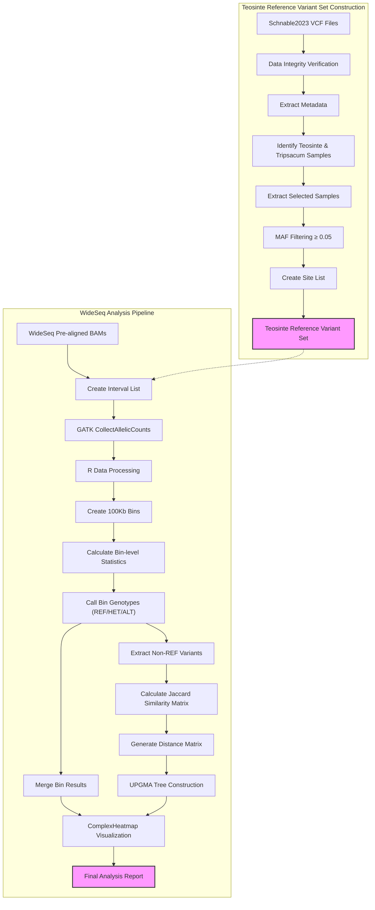

# BzeaSeq: Teosinte Reference Variant Set and WideSeq Analysis

## Table of Contents
- [1. Overview](#1-overview)
- [2. Directory Structure](#2-directory-structure)
- [3. Workflow Diagram](#3-workflow-diagram)
- [4. Teosinte Reference Variant Set Construction](#4-teosinte-reference-variant-set-construction)
  - [4.1 Background](#41-background)
  - [4.2 Data Acquisition](#42-data-acquisition)
  - [4.3 Data Exploration and Preparation](#43-data-exploration-and-preparation)
  - [4.4 Data Processing Pipeline](#44-data-processing-pipeline)
- [5. WideSeq Analysis Pipeline](#5-wideseq-analysis-pipeline)
  - [5.1 Allelic Count Collection](#51-allelic-count-collection)
  - [5.2 Bin Analysis with R](#52-bin-analysis-with-r)
  - [5.3 Phylogenetic Analysis](#53-phylogenetic-analysis)
  - [5.4 Introgression Visualization](#54-introgression-visualization)
- [6. References](#6-references)

This repository contains pipelines for constructing a Teosinte reference variant set from the Schnable2023 dataset and performing ancestry segment calling using the WideSeq approach.

## 1. Overview

This project consists of two main pipelines:

1. **Teosinte Reference Variant Set Construction**: Processes variant data from teosinte samples in the Schnable2023 study, including sample filtering based on taxonomy and variant filtering based on minor allele frequency.

2. **WideSeq Analysis Pipeline**: Processes WideSeq data to identify ancestry segments by collecting allelic counts at teosinte variant positions, analyzing bin-level genotypes, and creating phylogenetic trees and visualizations to understand introgression patterns.

Both pipelines are optimized for high-performance computing environments using LSF job scheduling.

## 2. Directory Structure

- `scripts/`: Contains all pipeline scripts
  - `teosinte_variants/`: Scripts for processing Schnable2023 teosinte variants
  - `wideseq/`: Scripts for WideSeq ancestry segment calling
  - `r_analysis/`: R scripts for statistical analysis and visualization
  - `utilities/`: Helper scripts for monitoring and job management
- `data/`: Input data
  - `reference/`: B73 reference genome (v5)
  - `schnable2023/`: Schnable2023 variant data
  - `wideseq_bams/`: WideSeq pre-aligned BAM files
- `results/`: Pipeline outputs
  - `variants/`: Filtered variant calls
  - `allelic_counts/`: GATK CollectAllelicCounts output
  - `bins/`: Bin-level ancestry calls
  - `phylogeny/`: Distance matrices and UPGMA trees
  - `heatmaps/`: Introgression pattern visualizations
- `logs/`: Log files from pipeline runs
- `envs/`: Conda environment files
- `docs/`: Documentation

## 3. Workflow Diagram



## 4. Teosinte Reference Variant Set Construction

### 4.1 Background

The Schnable2023 study published in The Plant Journal ("Exploring the pan-genome of the *Zea* genus through genome-wide association studies") includes variant data from both maize and teosinte samples already mapped to the B73 reference genome version 5 (`Zm-B73-REFERENCE-NAM-5.0`). This eliminates the need for liftover from v4 to v5 that was required for the Chen2022 dataset.
> **Note**: For information on processing the Chen2022 dataset, refer to [Chen2022_Processing.md](Chen2022_Processing.md).

### 4.2 Data Acquisition

The VCF files are distributed across 10 chromosome-specific files and are available from the SNPVersity 2.0 repository.

#### 4.2.1 Download Script

```bash
#!/bin/bash
# download_schnable2023_SNPs.sh
#
# Downloads VCF files for all 10 chromosomes from the Schnable2023 dataset.
# Includes MD5 checksum verification after download.

# --- Configuration ---
OUTPUT_DIR="./schnable2023"
CHECKSUMS_FILE="checksums.tab"

# Create output directory if it doesn't exist
mkdir -p ${OUTPUT_DIR}

# Process each chromosome
for chr in {1..10}; do
    echo "Downloading chromosome ${chr} VCF file..."
    
    # Extract download URL and MD5 checksum from checksums file
    URL=$(grep "schnable2023_chr${chr}.vcf.gz" ${CHECKSUMS_FILE} | awk -F'\t' '{print $6}')
    EXPECTED_MD5=$(grep "schnable2023_chr${chr}.vcf.gz" ${CHECKSUMS_FILE} | awk -F'\t' '{print $5}')
    
    if [ -z "${URL}" ] || [ -z "${EXPECTED_MD5}" ]; then
        echo "Error: Could not find URL or MD5 for chromosome ${chr}"
        continue
    fi
    
    OUTFILE="${OUTPUT_DIR}/schnable2023_chr${chr}.vcf.gz"
    
    # Download the file
    curl -L -o ${OUTFILE} ${URL}
    
    # Verify MD5 checksum
    ACTUAL_MD5=$(md5sum ${OUTFILE} | awk '{print $1}')
    
    if [ "${ACTUAL_MD5}" = "${EXPECTED_MD5}" ]; then
        echo "Verification successful for chromosome ${chr}"
    else
        echo "Verification failed for chromosome ${chr}"
        echo "Expected: ${EXPECTED_MD5}"
        echo "Actual: ${ACTUAL_MD5}"
    fi
done

echo "Download completed."
```

#### 4.2.2 File Naming Considerations

When working with the Schnable2023 dataset, you may encounter files with inconsistent naming. Some files may have typos in the prefix (e.g., `schanble2023` instead of `schnable2023`). For consistent pipeline processing, these naming issues need to be corrected using bash parameter substitution:

```bash
# Fix file naming inconsistencies using bash parameter substitution
for file in schanble2023_*.vcf.gz; do 
    mv -v "$file" "${file/schanble/schnable}"
done
```

This command will automatically replace all instances of "schanble" with "schnable" in the filenames, ensuring consistent naming throughout the dataset.

### 4.3 Data Exploration and Preparation

#### 4.3.1 Sample and Variant Statistics

To understand the dataset composition, we can examine the number of samples and variants:

```bash
# Count total samples in the dataset
bcftools query -l schnable2023/schnable2023_chr10.vcf.gz | wc -l

# Generate a complete sample list
bcftools query -l schnable2023/schnable2023_chr10.vcf.gz > schnable2023_id.list

# Get basic statistics for one chromosome
bcftools stats schnable2023/schnable2023_chr10.vcf.gz > schnable2023_chr10.stats
```

#### 4.3.2 Metadata Analysis for Teosinte Sample Selection

> **Note on Metadata**: The metadata for the Schnable2023 dataset was obtained from the supplementary materials in the original publication and manually curated to correct multiple typos, species name inconsistencies, and formatting issues.

Analyze the metadata to identify teosinte and Tripsacum samples:

```bash
# Taxonomic distribution
grep -v "Z. mays" schnable2023/schnable2023_metadata.tab | cut -f2 | grep -v "Species" | sort | uniq -c

# Create wild_relative list
grep -v "Z. mays" schnable2023/schnable2023_metadata.tab | cut -f1 | grep -v "ID">> wild_relatives_id.list

# Add B73 to the reference sample list
grep "B73" schnable2023/schnable2023_metadata.tab \
  | cut -f1 | cat - wild_relatives_id.list \
  | sort| uniq >  wideseq_ref_id.list      # Create a final sorted and deduplicated sample list
```

#### 4.3.3 Comparison with Chen2022 Dataset

Identify overlapping samples between Schnable2023 and Chen2022:

```bash
# Check which Chen2022 samples are in Schnable2023
grep -w -f chen2022_id.list schnable2023_id.list | wc -l

# Check which reference samples are in Schnable2023
grep -w -f wideseq_ref_id.list schnable2023_id.list | wc -l
```

### 4.4 Data Processing Pipeline

#### 4.4.1 Sample Extraction and Filtering

Create a script to extract the teosinte samples and apply MAF filtering:

```bash
#!/bin/bash
# get_variants_from_schnable2023.sh
#
# Extracts teosinte and Tripsacum samples from Schnable2023 VCF files
# and applies MAF filtering.

INPUT_DIR="./schnable2023"
OUTPUT_DIR="./wideseq_ref"
SAMPLE_LIST="wideseq_ref_id.list"

# This will bias against huehue 
MAF_THRESHOLD="0.05"

# Create output directory
mkdir -p ${OUTPUT_DIR}

# Process each chromosome
for chr in {1..10}; do
    echo "Processing chromosome ${chr}..."
    
    # Input and output file paths
    INPUT_VCF="${INPUT_DIR}/schnable2023_chr${chr}.vcf.gz"
    OUTPUT_VCF="${OUTPUT_DIR}/wideseq_chr${chr}.vcf.gz"
    
    # Extract samples and apply MAF filtering
    bcftools view -S ${SAMPLE_LIST} --min-af ${MAF_THRESHOLD}:minor ${INPUT_VCF} -Oz -o ${OUTPUT_VCF}
    
    # Index the output file
    bcftools index ${OUTPUT_VCF}
    
    echo "Completed chromosome ${chr}"
done

echo "All chromosomes processed."
```

#### 4.4.3 Variant Statistics

Calculate statistics for the filtered variants to assess their distribution and utility for ancestry analysis:

```bash
#!/bin/bash
# calculate_variant_stats.sh
#
# Calculates statistics for the filtered teosinte variants.

INPUT_DIR="./wideseq_ref"
OUTPUT_DIR="./stats"

# Create output directory
mkdir -p ${OUTPUT_DIR}

# Calculate total variants across all chromosomes
total_variants=0

# Process each chromosome
for chr in {1..10}; do
    echo "Calculating statistics for chromosome ${chr}..."
    
    # Input file
    INPUT_VCF="${INPUT_DIR}/wideseq_chr${chr}.vcf.gz"
    
    # Calculate statistics
    bcftools stats ${INPUT_VCF} > ${OUTPUT_DIR}/wideseq_chr${chr}.stats
    
    # Count variants
    variants=$(grep "number of SNPs:" ${OUTPUT_DIR}/wideseq_chr${chr}.stats | awk '{print $6}')
    total_variants=$((total_variants + variants))
    
    echo "Chromosome ${chr}: ${variants} variants"
done

echo "Total variants across all chromosomes: ${total_variants}"

# Calculate average variant density per 100kb
genome_size=2131846805  # Zm-B73-REFERENCE-NAM-5.0 nuclear chromosome length in bp
density_per_100kb=$(echo "scale=2; ${total_variants} * 100000 / ${genome_size}" | bc)

echo "Average variant density: ${density_per_100kb} variants per 100kb"
```

Giving the following output:
```
Calculating statistics for chromosome 1...
Chromosome 1: 4014996 variants
Calculating statistics for chromosome 2...
Chromosome 2: 3107336 variants
Calculating statistics for chromosome 3...
Chromosome 3: 3134513 variants
Calculating statistics for chromosome 4...
Chromosome 4: 3536756 variants
Calculating statistics for chromosome 5...
Chromosome 5: 2884437 variants
Calculating statistics for chromosome 6...
Chromosome 6: 2148207 variants
Calculating statistics for chromosome 7...
Chromosome 7: 2304091 variants
Calculating statistics for chromosome 8...
Chromosome 8: 2287674 variants
Calculating statistics for chromosome 9...
Chromosome 9: 2185739 variants
Calculating statistics for chromosome 10...
Chromosome 10: 2058789 variants
Total variants across all chromosomes: 27662538
Average variant density: 1297.58 variants per 100kb
```

## 5. WideSeq Analysis Pipeline

### 5.1 Allelic Count Collection

The WideSeq analysis pipeline begins by collecting allelic counts at teosinte variant positions using GATK's CollectAllelicCounts tool.

#### 5.1.1 Running GATK CollectAllelicCounts

For each sample, collect reference and alternate allele counts at the positions in the interval list:

```bash
#!/bin/bash
# collect_allelic_counts.sh
#
# Collects allelic counts for each sample at teosinte variant positions.

BAM_DIR="/path/to/wideseq_bams"
REFERENCE_GENOME="/path/to/reference/Zm-B73-REFERENCE-NAM-5.0.fa"
INTERVAL_LIST="./intervals/wideseq_all.interval_list"
OUTPUT_DIR="./allelic_counts"

# Create output directory
mkdir -p ${OUTPUT_DIR}

# Process each BAM file
for BAM_FILE in ${BAM_DIR}/*.bam; do
    # Extract sample name from BAM filename
    SAMPLE=$(basename ${BAM_FILE} .bam)
    
    echo "Processing sample ${SAMPLE}..."
    
    # Run GATK CollectAllelicCounts
    gatk CollectAllelicCounts \
        -I ${BAM_FILE} \
        -R ${REFERENCE_GENOME} \
        -L ${INTERVAL_LIST} \
        -O ${OUTPUT_DIR}/${SAMPLE}.allelicCounts.tsv
    
    echo "Completed sample ${SAMPLE}"
done

echo "All samples processed."
```

#### 5.1.2 Output Format

The GATK CollectAllelicCounts tool produces a tab-separated file with the following columns:

- CONTIG: Chromosome name
- POSITION: Position on the chromosome
- REF_NUCLEOTIDE: Reference base at this position
- ALT_NUCLEOTIDE: Alternate base at this position
- REF_COUNT: Number of reads supporting the reference allele
- ALT_COUNT: Number of reads supporting the alternate allele
- TOTAL_COUNT: Total number of reads covering this position

Example output:
```
CONTIG  POSITION    REF_NUCLEOTIDE    ALT_NUCLEOTIDE    REF_COUNT    ALT_COUNT    TOTAL_COUNT
chr1    123456      A                 G                 15           5            20
chr1    234567      C                 T                 8            12           20
```

### 5.2 Bin Analysis with R

The allelic count data is processed using R with the data.table package for efficient handling of large datasets.

#### 5.2.1 Reading and Processing Allelic Counts

```R
# Load necessary libraries
library(data.table)
library(parallel)

# Set the number of cores for parallel processing
num_cores <- parallel::detectCores() - 1

# Function to read and process one sample's allelic counts
process_sample <- function(sample_name, bin_size = 100000) {
  # Read allelic counts file
  counts_file <- file.path("allelic_counts", paste0(sample_name, ".allelicCounts.tsv"))
  
  # Skip header lines (GATK output has headers)
  allelic_counts <- fread(counts_file, skip = "#", 
                          col.names = c("contig", "position", "refAllele", "altAllele", "refCount", "altCount", "totalCount"))
  
  # Calculate allele frequencies
  allelic_counts[, ref_freq := refCount / totalCount]
  allelic_counts[, alt_freq := altCount / totalCount]
  
  # Create bin information
  allelic_counts[, bin_start := floor(position / bin_size) * bin_size]
  allelic_counts[, bin_end := bin_start + bin_size - 1]
  allelic_counts[, bin_id := paste0(contig, "_", bin_start)]
  
  # Calculate bin-level statistics
  bin_stats <- allelic_counts[, .(
    mean_ref_freq = mean(ref_freq, na.rm = TRUE),
    mean_alt_freq = mean(alt_freq, na.rm = TRUE),
    variant_count = .N,
    ref_variant_count = sum(ref_freq >= 0.7, na.rm = TRUE),
    het_variant_count = sum(ref_freq > 0.3 & ref_freq < 0.7, na.rm = TRUE),
    alt_variant_count = sum(ref_freq <= 0.3, na.rm = TRUE)
  ), by = .(contig, bin_start, bin_end, bin_id)]
  
  # Classify bins
  bin_stats[, genotype := ifelse(variant_count < 5, "NO_DATA",
                        ifelse(mean_ref_freq >= 0.7, "REF",
                        ifelse(mean_alt_freq >= 0.7, "ALT", "HET")))]
  
  # Add sample information
  bin_stats[, sample := sample_name]
  
  return(bin_stats)
}

# Process all samples in parallel
sample_names <- list.files(path = "allelic_counts", pattern = "*.allelicCounts.tsv$") %>%
  sub(pattern = "\\.allelicCounts\\.tsv$", replacement = "")

all_bin_stats <- mclapply(sample_names, process_sample, mc.cores = num_cores) %>%
  rbindlist()

# Save bin-level results
fwrite(all_bin_stats, "results/all_samples_bin_genotypes.csv")
```

#### 5.2.2 Extracting Non-reference Variants for Jaccard Calculation

```R
# Create non-ref variant list for each sample for Jaccard calculation
non_ref_variants <- function(sample_name, bin_size = 100000) {
  # Get bin IDs with non-reference genotypes
  non_ref_bins <- all_bin_stats[sample == sample_name & genotype %in% c("HET", "ALT"), bin_id]
  
  # Read allelic counts again
  counts_file <- file.path("allelic_counts", paste0(sample_name, ".allelicCounts.tsv"))
  allelic_counts <- fread(counts_file, skip = "#", 
                          col.names = c("contig", "position", "refAllele", "altAllele", "refCount", "altCount", "totalCount"))
  
  # Add bin information
  allelic_counts[, bin_start := floor(position / bin_size) * bin_size]
  allelic_counts[, bin_id := paste0(contig, "_", bin_start)]
  
  # Filter to variants in non-reference bins
  non_ref_variants <- allelic_counts[bin_id %in% non_ref_bins]
  
  # Add binary indicator for non-reference allele
  non_ref_variants[, has_alt := altCount > 0]
  
  # Return key information
  result <- non_ref_variants[, .(contig, position, has_alt, sample = sample_name)]
  return(result)
}

# Process all samples
all_non_ref <- mclapply(sample_names, non_ref_variants, mc.cores = num_cores) %>%
  rbindlist()

# Save for Jaccard calculation
fwrite(all_non_ref, "results/non_ref_variants_for_jaccard.csv")
```

### 5.3 Phylogenetic Analysis

The next step is calculating Jaccard similarities and generating a phylogenetic tree.

#### 5.3.1 Calculating Jaccard Similarities

```R
# Load necessary libraries
library(data.table)
library(ape)  # For phylogenetic functions

# Read non-ref variants
all_non_ref <- fread("results/non_ref_variants_for_jaccard.csv")

# Read teosinte variant data
teosinte_data <- fread("results/teosinte_variants.csv")  # Precomputed teosinte variant data

# Function to calculate Jaccard similarity between a sample and teosinte accessions
calculate_jaccard <- function(sample_name, teosinte_data) {
  # Get sample's non-ref variants
  sample_variants <- all_non_ref[sample == sample_name, .(contig, position, has_alt)]
  
  # Calculate Jaccard similarities with all teosinte accessions
  results <- data.table(accession = character(), jaccard = numeric())
  
  for (acc in unique(teosinte_data$accession)) {
    # Get teosinte accession variants
    acc_variants <- teosinte_data[accession == acc, .(contig, position, has_alt)]
    
    # Merge to find shared positions
    merged <- merge(sample_variants, acc_variants, 
                    by = c("contig", "position"), 
                    suffixes = c(".sample", ".acc"))
    
    # Calculate Jaccard
    matching <- sum(merged$has_alt.sample & merged$has_alt.acc)
    total <- sum(merged$has_alt.sample | merged$has_alt.acc)
    jaccard <- ifelse(total > 0, matching / total, 0)
    
    results <- rbind(results, data.table(accession = acc, jaccard = jaccard))
  }
  
  results[, sample := sample_name]
  return(results)
}

# Process all samples
jaccard_results <- rbindlist(lapply(sample_names, calculate_jaccard, teosinte_data = teosinte_data))

# Save results
fwrite(jaccard_results, "results/jaccard_similarities.csv")
```

#### 5.3.2 Creating Distance Matrix and UPGMA Tree

```R
# Create specialized distance matrix
# (Using the approach described in previous updates)

# Create distance matrix for UPGMA
samples_and_teosintes <- c(sample_names, unique(teosinte_data$accession))
dist_matrix <- matrix(1, nrow = length(samples_and_teosintes), ncol = length(samples_and_teosintes))
rownames(dist_matrix) <- colnames(dist_matrix) <- samples_and_teosintes

# Fill in sample-to-sample distances (using all variants)
for (i in 1:length(sample_names)) {
  for (j in (i+1):length(sample_names)) {
    if (j <= length(sample_names)) {
      s1 <- sample_names[i]
      s2 <- sample_names[j]
      
      # Calculate Jaccard similarity using all variants
      # (Calculation code here)
      
      # Set distance
      dist_matrix[s1, s2] <- dist_matrix[s2, s1] <- 1 - jaccard_sim
    }
  }
}

# Fill in teosinte-to-teosinte distances (using all variants)
# (Code for teosinte-to-teosinte distances)

# Fill in sample-to-teosinte distances (using only non-ref variants)
for (i in 1:nrow(jaccard_results)) {
  row <- jaccard_results[i]
  dist_matrix[row$sample, row$accession] <- dist_matrix[row$accession, row$sample] <- 1 - row$jaccard
}

# Set diagonal to 0
diag(dist_matrix) <- 0

# Convert to dist object
dist_obj <- as.dist(dist_matrix)

# Create UPGMA tree
upgma_tree <- upgma(dist_obj)

# Save tree in Newick format
write.tree(upgma_tree, "results/upgma_tree.newick")

# Save distance matrix
write.table(dist_matrix, "results/distance_matrix.txt", sep="\t", quote=FALSE)
```

### 5.4 Introgression Visualization

The final step is visualizing the introgression patterns using ComplexHeatmap in R.

#### 5.4.1 Creating Genotype Heatmap with Dendrogram

```R
# Load necessary libraries
library(data.table)
library(ComplexHeatmap)
library(circlize)
library(ape)
library(RColorBrewer)

# Read bin genotypes
all_bins <- fread("results/all_samples_bin_genotypes.csv")

# Read UPGMA tree
tree <- read.tree("results/upgma_tree.newick")

# Extract sample names from tree in the correct order
sample_order <- tree$tip.label[tree$tip.label %in% unique(all_bins$sample)]

# Create matrix for heatmap
# Reshape from long to wide format
bins_wide <- dcast(all_bins, bin_id ~ sample, value.var = "genotype")
bin_ids <- bins_wide$bin_id
bins_wide[, bin_id := NULL]

# Convert to matrix
bins_matrix <- as.matrix(bins_wide)
rownames(bins_matrix) <- bin_ids

# Ensure columns are in tree order
bins_matrix <- bins_matrix[, sample_order]

# Define colors for genotypes
genotype_colors <- c("REF" = "#2ca02c", "HET" = "#ff7f0e", "ALT" = "#d62728", "NO_DATA" = "#d3d3d3")

# Parse bin IDs to get chromosome and position info
bin_info <- data.table(bin_id = rownames(bins_matrix))
bin_info[, c("chrom", "start") := tstrsplit(bin_id, "_", fixed=TRUE)]
bin_info[, start := as.numeric(start)]
bin_info[, chrom := factor(chrom, levels = paste0("chr", 1:10))]

# Sort by chromosome and position
bin_info <- bin_info[order(chrom, start)]
bins_matrix <- bins_matrix[bin_info$bin_id, ]

# Create chromosome annotation
chrom_levels <- paste0("chr", 1:10)
chromosomes <- factor(bin_info$chrom, levels = chrom_levels)
chrom_colors <- setNames(brewer.pal(10, "Paired"), chrom_levels)

# Create row annotation for chromosomes
row_ha <- rowAnnotation(
  Chromosome = chromosomes,
  col = list(Chromosome = chrom_colors),
  show_legend = TRUE
)

# Extract sample dendrogram from tree
sample_tree <- keep.tip(tree, sample_order)
dend <- as.dendrogram(sample_tree)

# Create heatmap
hm <- Heatmap(
  bins_matrix,
  name = "Genotype",
  col = genotype_colors,
  cluster_rows = FALSE,  # Already sorted by chromosome and position
  cluster_columns = dend,  # Use pre-computed dendrogram
  show_row_names = FALSE,
  show_column_names = TRUE,
  column_names_gp = gpar(fontsize = 8),
  heatmap_legend_param = list(title = "Bin Genotype"),
  left_annotation = row_ha,
  column_title = "WideSeq Bin Genotypes Grouped by UPGMA Tree",
  column_title_gp = gpar(fontsize = 14, fontface = "bold")
)

# Save the plot
pdf("results/genotype_heatmap_with_dendrogram.pdf", width = 12, height = 12)
draw(hm)
dev.off()
```

#### 5.4.2 Creating Chromosome-level Summary Heatmap

```R
# Calculate percentage of non-reference bins by chromosome
chrom_summary <- all_bins[, .(
  total_bins = .N,
  non_ref_bins = sum(genotype %in% c("HET", "ALT")),
  non_ref_pct = 100 * sum(genotype %in% c("HET", "ALT")) / .N
), by = .(sample, contig)]

# Reshape for heatmap
chrom_wide <- dcast(chrom_summary, sample ~ contig, value.var = "non_ref_pct")
samples <- chrom_wide$sample
chrom_wide[, sample := NULL]
# Create composite visualization with both heatmaps
pdf("results/composite_visualization.pdf", width = 16, height = 14)
draw(
  hm + chrom_hm,
  column_title = "WideSeq Analysis: Bin Genotypes and Chromosome Summary",
  column_title_gp = gpar(fontsize = 16, fontface = "bold")
)
dev.off()
# Convert to matrix
chrom_matrix <- as.matrix(chrom_wide)
rownames(chrom_matrix) <- samples

# Ensure rows are in tree order
chrom_matrix <- chrom_matrix[sample_order, ]

# Create heatmap
chrom_hm <- Heatmap(
  chrom_matrix,
  name = "NON-REF %",
  col = colorRamp2(c(0, 50, 100), c("white", "orange", "red")),
  cluster_rows = dend,  # Use pre-computed dendrogram
  cluster_columns = FALSE,  # Chromosomes in order
  show_row_names = TRUE,
  show_column_names = TRUE,
  column_names_gp = gpar(fontsize = 10),
  row_names_gp = gpar(fontsize = 8),
  heatmap_legend_param = list(title = "NON-REF Bin %"),
  column_title = "Percentage of NON-REF Bins by Chromosome",
  column_title_gp = gpar(fontsize = 14, fontface = "bold")
)

# Save the plot
pdf("results/chromosome_summary_heatmap.pdf", width = 10, height = 12)
draw(chrom_hm)
dev.off()
```

# 5.4.3 Creating Composite Visualization

```R
# Create composite visualization with both heatmaps
pdf("results/composite_visualization.pdf", width = 16, height = 14)
draw(
  hm + chrom_hm,
  column_title = "WideSeq Analysis: Bin Genotypes and Chromosome Summary",
  column_title_gp = gpar(fontsize = 16, fontface = "bold")
)
dev.off()

# Generate summary report
summary_stats <- all_bins[, .(
  total_bins = .N,
  ref_bins = sum(genotype == "REF"),
  het_bins = sum(genotype == "HET"),
  alt_bins = sum(genotype == "ALT"),
  no_data_bins = sum(genotype == "NO_DATA"),
  ref_pct = 100 * sum(genotype == "REF") / .N,
  het_pct = 100 * sum(genotype == "HET") / .N,
  alt_pct = 100 * sum(genotype == "ALT") / .N,
  non_ref_pct = 100 * sum(genotype %in% c("HET", "ALT")) / .N
), by = sample]

# Sort by non-ref percentage
summary_stats <- summary_stats[order(-non_ref_pct)]

# Save summary stats
fwrite(summary_stats, "results/sample_summary_stats.csv")

# Create an HTML report with results
html_report <- '<!DOCTYPE html>
<html>
<head>
    <title>WideSeq Analysis Report</title>
    <style>
        body { font-family: Arial, sans-serif; line-height: 1.6; margin: 20px; }
        h1, h2, h3 { color: #333366; }
        .container { max-width: 1200px; margin: 0 auto; }
        .figure { margin: 20px 0; text-align: center; }
        .figure img { max-width: 100%; border: 1px solid #ddd; }
        table { border-collapse: collapse; width: 100%; margin: 20px 0; }
        th, td { text-align: left; padding: 8px; border: 1px solid #ddd; }
        th { background-color: #f2f2f2; }
        tr:nth-child(even) { background-color: #f9f9f9; }
    </style>
</head>
<body>
    <div class="container">
        <h1>WideSeq Analysis Report</h1>
        
        <h2>Bin Genotype Analysis</h2>
        <p>
            The analysis pipeline processed ' + length(sample_names) + ' samples, 
            examining allelic counts at ' + sum(all_bins$variant_count) + ' variant positions
            across the maize genome.
        </p>
        
        <div class="figure">
            
            <p>Figure 1: Composite visualization showing bin genotypes and chromosome summary, grouped by UPGMA tree.</p>
        </div>
        
        <h2>Sample Summary Statistics</h2>
        <table>
            <tr>
                <th>Sample</th>
                <th>Total Bins</th>
                <th>REF Bins</th>
                <th>HET Bins</th>
                <th>ALT Bins</th>
                <th>NON-REF %</th>
            </tr>'

# Add rows for each sample
for (i in 1:nrow(summary_stats)) {
  row <- summary_stats[i]
  html_report <- paste0(html_report, '
            <tr>
                <td>', row$sample, '</td>
                <td>', row$total_bins, '</td>
                <td>', row$ref_bins, ' (', round(row$ref_pct, 1), '%)</td>
                <td>', row$het_bins, ' (', round(row$het_pct, 1), '%)</td>
                <td>', row$alt_bins, ' (', round(row$alt_pct, 1), '%)</td>
                <td>', round(row$non_ref_pct, 1), '%</td>
            </tr>')
}

html_report <- paste0(html_report, '
        </table>
        
        <h2>Top Teosinte Matches</h2>
        <p>
            Based on Jaccard similarity calculations using variants in non-reference bins,
            the following are the top teosinte matches for each sample:
        </p>
        
        <table>
            <tr>
                <th>Sample</th>
                <th>Top Match</th>
                <th>Jaccard Similarity</th>
            </tr>')

# Add top matches for each sample
for (sample in unique(jaccard_results$sample)) {
  top_match <- jaccard_results[sample == sample][order(-jaccard)][1]
  html_report <- paste0(html_report, '
            <tr>
                <td>', sample, '</td>
                <td>', top_match$accession, '</td>
                <td>', round(top_match$jaccard, 3), '</td>
            </tr>')
}

html_report <- paste0(html_report, '
        </table>
        
        <h2>Downloads</h2>
        <ul>
            <li><a href="genotype_heatmap_with_dendrogram.pdf">Detailed Genotype Heatmap (PDF)</a></li>
            <li><a href="chromosome_summary_heatmap.pdf">Chromosome Summary Heatmap (PDF)</a></li>
            <li><a href="composite_visualization.pdf">Composite Visualization (PDF)</a></li>
            <li><a href="sample_summary_stats.csv">Sample Summary Statistics (CSV)</a></li>
            <li><a href="jaccard_similarities.csv">Jaccard Similarity Results (CSV)</a></li>
            <li><a href="distance_matrix.txt">Distance Matrix (TXT)</a></li>
            <li><a href="upgma_tree.newick">UPGMA Tree (Newick format)</a></li>
        </ul>
    </div>
</body>
</html>'

# Write HTML report
writeLines(html_report, "results/wideseq_analysis_report.html")

# Convert PDFs to PNGs for HTML display
system("convert -density 150 results/composite_visualization.pdf results/composite_visualization.png")

# Create PNG versions of all plots for easier viewing
system("convert -density 150 results/genotype_heatmap_with_dendrogram.pdf results/genotype_heatmap_with_dendrogram.png")
system("convert -density 150 results/chromosome_summary_heatmap.pdf results/chromosome_summary_heatmap.png")
```

# 6. References

 * Schnable, J.C., et al. (2023). Exploring the pan-genome of the Zea genus through genome-wide association studies. The Plant Journal, 116(1), 225-238. https://doi.org/10.1111/tpj.16123
 
 * Chen, Q., et al. (2022). Genome sequencing reveals evidence of adaptive variation in the genus Zea. Nature Genetics, 54, 1386-1396. https://doi.org/10.1038/s41588-022-01184-y

 * Andorf, C.M., Ross-Ibarra, J., Seetharam, A.S., et al. (2025). A unified VCF dataset from nearly 1,500 diverse maize accessions and resources to explore the genomic landscape of maize. G3 Genes|Genomes|Genetics, 15(2), jkae281. https://doi.org/10.1093/g3journal/jkae281
 
 * Hufford, M.B., Seetharam, A.S., Woodhouse, M.R., et al. (2021). De novo assembly, annotation, and comparative analysis of 26 diverse maize genomes. Science, 373(6555), 655-662. https://doi.org/10.1126/science.abg5289
