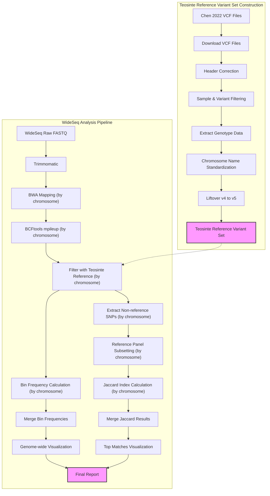

# BzeaSeq: Teosinte Reference Variant Set and WideSeq Analysis

## Table of Contents
- [1. Overview](#1-overview)
- [2. Directory Structure](#2-directory-structure)
- [3. Workflow Diagram](#3-workflow-diagram)
- [4. Teosinte Reference Variant Set Construction](#4-teosinte-reference-variant-set-construction)
  - [4.1 Background](#41-background)
  - [4.2 Data Acquisition](#42-data-acquisition)
  - [4.3 Data Exploration and Preparation](#43-data-exploration-and-preparation)
  - [4.4 Data Processing Pipeline](#44-data-processing-pipeline)
- [5. References](#5-references)

This repository contains pipelines for constructing a Teosinte reference variant set from the Chen 2022 dataset and performing ancestry segment calling using the WideSeq approach.

## 1. Overview

This project consists of two main pipelines:

1. **Teosinte Reference Variant Set Construction**: Downloads and processes large-scale variant data from teosinte samples in the Chen 2022 study, including header correction, filtering, and liftover from B73v4 to B73v5 reference.

2. **WideSeq Analysis Pipeline**: Processes WideSeq data to identify ancestry segments by aligning to B73, calling SNPs, comparing to the teosinte reference variant set, and calculating bin frequencies and haplotype similarities.

Both pipelines are optimized for high-performance computing environments using LSF job scheduling.

## 2. Directory Structure

- `scripts/`: Contains all pipeline scripts
  - `teosinte_variants/`: Scripts for processing Chen 2022 teosinte variants
  - `wideseq/`: Scripts for WideSeq ancestry segment calling
  - `utilities/`: Helper scripts for monitoring and job management
- `data/`: Input data
  - `reference/`: B73 reference genome (v4 and v5)
  - `chen2022/`: Chen 2022 teosinte variant data
  - `wideseq_fastq/`: WideSeq sequencing data
- `results/`: Pipeline outputs
- `logs/`: Log files from pipeline runs
- `envs/`: Conda environment files
- `docs/`: Documentation

## 3. Workflow Diagram



## 4. Teosinte Reference Variant Set Construction

### 4.1 Background

The Chen 2022 study published in Nature ("Genome sequencing reveals evidence of adaptive variation in the genus *Zea*") includes approximately 75 million SNPs from teosinte samples in B73 reference genome version 4. The plan is to download these samples and lift them over to reference genome version 5 for integration into the WideSeq pipeline.

### 4.2 Data Acquisition

The SNP data is distributed across multiple files named `merge_1.filter.vcf.gz` through `merge_10.filter.vcf.gz` and is available from the Chinese National GeneBank (CNGB).

#### 4.2.1 Download Script

The script below uses Aspera to download the SNP files. It includes checks to avoid re-downloading files that already exist locally:

```bash
#!/bin/bash
# download_chen2022_SNPs.sh 
# downloading data from https://ftp.cngb.org/pub/CNSA/data3/CNP0001565/zeamap/02_Variants/PAN_Zea_Variants/Zea-vardb/

# --- Configuration ---
KEY_FILE="aspera_download.key"
KEY_URL="ftp://ftp.cngb.org/pub/Tool/Aspera/aspera_download.key"
REMOTE_USER_HOST="aspera_download@183.239.175.39"
REMOTE_BASE_DIR="/pub/CNSA/data3/CNP0001565/zeamap/02_Variants/PAN_Zea_Variants/Zea-vardb"
ASCP_PORT="33001"
ASCP_RATE="100m"  # Max transfer rate
ASCP_OPTS="-T -k 1"  # Disable encryption, enable resume
LOCAL_DEST_DIR="./"  # Download to the current directory
START_NUM=1
END_NUM=10
# --- End Configuration ---

# Function for logging messages
log() {
    echo "$(date '+%Y-%m-%d %H:%M:%S') - $1"
}

# 1. Download the Aspera key file if it doesn't exist
if [ -f "${KEY_FILE}" ]; then
    log "Aspera key file '${KEY_FILE}' already exists, skipping download."
else
    log "Attempting to download Aspera key from ${KEY_URL}..."
    curl -o "${KEY_FILE}" -s "${KEY_URL}"
    
    # Check if curl command failed (exit status non-zero)
    if [ $? -ne 0 ]; then
        log "ERROR: Failed to download the Aspera key file using curl. Please check network connection and URL."
        exit 1
    fi
    
    # Check if the key file actually exists after curl command
    if [ ! -f "${KEY_FILE}" ]; then
        log "ERROR: Aspera key file '${KEY_FILE}' not found after download attempt. Curl might have failed silently."
        exit 1
    fi
    
    log "Aspera key file '${KEY_FILE}' downloaded successfully."
fi

# 2. Loop through the file numbers and download using ascp
log "Starting downloads from ${START_NUM} to ${END_NUM}..."
for i in $(seq ${START_NUM} ${END_NUM})
do
    # Construct the full remote file path
    REMOTE_FILE_PATH="${REMOTE_USER_HOST}:${REMOTE_BASE_DIR}/merge_${i}.filter.vcf.gz"
    LOCAL_FILENAME="merge_${i}.filter.vcf.gz"
    LOCAL_FILE_PATH="${LOCAL_DEST_DIR}/${LOCAL_FILENAME}"
    
    # Check if the file already exists
    if [ -f "${LOCAL_FILE_PATH}" ]; then
        log "File ${LOCAL_FILENAME} already exists locally. Skipping download."
        continue
    fi
    
    # Just the filename for logging
    log "Initiating download for ${LOCAL_FILENAME}..."
    
    # Execute the ascp command
    ascp -i "${KEY_FILE}" -P "${ASCP_PORT}" ${ASCP_OPTS} -l "${ASCP_RATE}" "${REMOTE_FILE_PATH}" "${LOCAL_DEST_DIR}"
    
    # Check the exit status of the ascp command
    if [ $? -eq 0 ]; then
        log "Successfully downloaded ${LOCAL_FILENAME}."
    else
        log "WARNING: Failed to download ${LOCAL_FILENAME}. Check ascp output/logs for details. Continuing with next file..."
        # If you want the script to stop on the first error, uncomment the next line:
        # exit 1
    fi
done

log "All download attempts finished."

# Optional: Clean up the key file if desired
# log "Removing key file '${KEY_FILE}'."
# rm -f "${KEY_FILE}"

exit 0
```

### 4.3 Data Exploration and Preparation

#### 4.3.1 Sample and Variant Statistics

To verify the downloaded data, we can examine the number of samples and variants:

```bash
bcftools query -l ../Zea-vardb/merge_10.filter.vcf.gz| wc -l
```

```
744
```

```bash
bcftools stats ../Zea-vardb/merge_10.filter.vcf.gz > merge_10.filter.stats
more merge_10.filter.stats
```

```
SN	0	number of samples:	744
SN	0	number of records:	5055237
SN	0	number of no-ALTs:	0
SN	0	number of SNPs:	5055237
SN	0	number of MNPs:	0
SN	0	number of indels:	0
SN	0	number of others:	0
SN	0	number of multiallelic sites:	319084
SN	0	number of multiallelic SNP sites:	319084
```

The statistics show 744 samples and over 5 million SNPs in chromosome 10 alone, confirming the dataset should contain more than 70 million SNPs across all chromosomes.

#### 4.3.2 Reference Genotype Confirmation

We confirmed that B73 (the reference genotype) is included in the dataset:

```bash
grep B73 chen2022_passport.tab
```

```
B73	-	-	-	285169576	277505548	97.31 	97.47 	19.72 	60259366	21.13 	-	-	Zea mays subsp. mays	Zea mays subsp. mays (TEM)
```

#### 4.3.3 Teosinte Sample Analysis

The dataset contains 238 teosinte samples (non-maize subspecies and non-Tripsacum):

```bash
grep -v "subsp. mays" chen2022_passport.tab | grep -v "Tripsacum" | wc -l
```

```
238
```

The taxonomic breakdown of teosinte samples is as follows:

```bash
grep -v "subsp. mays" chen2022_passport.tab | grep -v "Tripsacum"| cut -f 15|  sort |uniq -c
```

```
      1 New taxonomyb
     14 Teosinte (mix)
     20 Zea diploperennis
     14 Zea luxurians
      5 Zea mays subsp. huehuetenangensis
     81 Zea mays subsp. mexicana
     70 Zea mays subsp. parviglumis
     14 Zea nicaraguensis
     19 Zea perennis
```

#### 4.3.4 Sample Selection for Analysis

To prepare for downstream analysis, we selected teosinte samples and the B73 reference:

```bash
tail -n +2 chen2022_passport.tab| grep -v "subsp. mays"  |grep -v "Tripsacum"| cut -f1 > teosinte_id.list
grep B73 chen2022_passport.tab | cut -f1 >  B73_id.list
cat B73_id.list teosinte_id.list > wideseq_ref_id.list
more wideseq_ref_id.list
```

### 4.4 Data Processing Pipeline

#### 4.4.1 Header Correction

The VCF files have improper headers that need to be fixed before processing:

```bash
# Replace existing headers with corrected ones
bcftools reheader -h chen2022_vcf_header.txt ../Zea-vardb/merge_10.filter.vcf.gz -o ../Zea-vardb/merge_10.header.vcf.gz

# Alternative using Picard
picard FixVcfHeader \
     --CHECK_FIRST_N_RECORDS 1000 \
     -I ../Zea-vardb/merge_10.filter.vcf.gz \
     -O ../Zea-vardb/merge_10.header.vcf.gz
```

#### 4.4.2 Sample and Variant Filtering

Extract only samples of interest and apply filtering:

```bash
# Select samples and filter for variants with MAF > 0.05
bcftools view -q 0.05:minor -S wideseq_ref_id.list --min-ac=1 \
  ../Zea-vardb/merge_10.header.vcf.gz \
  -o ../Zea-vardb/chr10.wideseq.v4.vcf.gz
```

#### 4.4.3 Creating Minimal VCF Files

To reduce file sizes and simplify processing, we can create minimal VCF files containing only genotype (GT) information with no additional FORMAT or INFO fields:

##### Option 1: Using bcftools annotate
This approach removes all INFO fields and all FORMAT fields except for GT:

```bash
# Create a minimal VCF with only GT field, no other FORMAT or INFO fields
bcftools annotate -x INFO,^FORMAT/GT \
  ../Zea-vardb/chr10.wideseq.v4.vcf.gz \
  -Oz -o ../Zea-vardb/chr10.wideseq.v4.minimal.vcf.gz 

# Index the output file
bcftools index ../Zea-vardb/chr10.wideseq.v4.minimal.vcf.gz 
```

##### Option 2: Complete script for processing all chromosomes

```bash
#!/bin/bash
# create_minimal_vcf.sh

INPUT_DIR="../Zea-vardb"
OUTPUT_DIR="teosinte_minimal_vcf"
SAMPLES_FILE="wideseq_ref_id.list"

# Create output directory
mkdir -p ${OUTPUT_DIR}

# Convert sample list to comma-separated format for bcftools
SAMPLES=$(cat ${SAMPLES_FILE} | tr '\n' ',')
# Remove trailing comma if needed
SAMPLES=${SAMPLES%,}

# Create a minimal header template
cat > ${OUTPUT_DIR}/minimal_header.txt << EOL
##fileformat=VCFv4.2
##FORMAT=<ID=GT,Number=1,Type=String,Description="Genotype">
EOL

# Process each chromosome file
for i in $(seq 1 10); do
    echo "Processing merge_${i}.filter.vcf.gz..."
    
    # Extract contig lines from the original header for this chromosome
    bcftools view -h ${INPUT_DIR}/merge_${i}.filter.vcf.gz | grep "^##contig" > ${OUTPUT_DIR}/contigs_${i}.txt
    
    # Extract samples line from the header
    bcftools view -h ${INPUT_DIR}/merge_${i}.filter.vcf.gz | grep "^#CHROM" > ${OUTPUT_DIR}/samples_${i}.txt
    
    # Create complete header for this chromosome
    cat ${OUTPUT_DIR}/minimal_header.txt ${OUTPUT_DIR}/contigs_${i}.txt ${OUTPUT_DIR}/samples_${i}.txt > ${OUTPUT_DIR}/header_${i}.txt
    
    # Remove all INFO fields and FORMAT fields except GT
    bcftools annotate -x INFO,^FORMAT/GT ${INPUT_DIR}/merge_${i}.filter.vcf.gz -Ov -o ${OUTPUT_DIR}/data_${i}.vcf
    
    # Replace header with minimal header
    bcftools reheader -h ${OUTPUT_DIR}/header_${i}.txt ${OUTPUT_DIR}/data_${i}.vcf | \
    bcftools view -Oz -o ${OUTPUT_DIR}/merge_${i}.minimal.vcf.gz
    
    # Index the output file
    bcftools index ${OUTPUT_DIR}/merge_${i}.minimal.vcf.gz
    
    # Clean up temporary files
    rm ${OUTPUT_DIR}/contigs_${i}.txt ${OUTPUT_DIR}/samples_${i}.txt ${OUTPUT_DIR}/header_${i}.txt ${OUTPUT_DIR}/data_${i}.vcf
    
    echo "Completed merge_${i}"
done

# Clean up remaining temporary files
rm ${OUTPUT_DIR}/minimal_header.txt

echo "All files processed successfully."
```

#### 4.4.4 Chromosome Naming Standardization

Different references use different chromosome naming conventions:
- `Zm-B73-REFERENCE-GRAMENE-4.0`: Chr1, Chr2, ... Chr10
- `B73_RefGen_v4_to_Zm-B73-REFERENCE-NAM-5.0.chain`: chr1, chr2, ... chr10
- VCF files from Chen 2022: 1, 2, ... 10

Standardize chromosome names to ensure compatibility:

```bash
# For VCF files - change chromosome names to match reference
for i in $(seq 1 10); do
  # Create temporary file with chr names converted to Chr format
  bcftools annotate --rename-chrs chr_name_map.txt \
    ../Zea-vardb/merge_${i}.header.vcf.gz \
    -o ../Zea-vardb/merge_${i}.renamed.vcf.gz
  
  # Index the renamed files
  bcftools index ../Zea-vardb/merge_${i}.renamed.vcf.gz
done
```

Where `chr_name_map.txt` contains:
```
1   Chr1
2   Chr2
3   Chr3
4   Chr4
5   Chr5
6   Chr6
7   Chr7
8   Chr8
9   Chr9
10  Chr10
```

#### 4.4.5 Liftover from v4 to v5 Reference

##### Fix Chain File Format
The chain file needs to be properly formatted:

```bash
# Convert spaces to tabs in chain file for compatibility with tools
perl -i -pe 'if ($_ !~ /chain/) {s/ +/\t/g}' B73_RefGen_v4_to_Zm-B73-REFERENCE-NAM-5.0.chain
```

##### Perform Liftover Using Picard
Run liftover for each chromosome:

```bash
# Liftover script
for i in $(seq 1 10); do
  picard LiftoverVcf \
    I=../Zea-vardb/merge_${i}.renamed.vcf.gz \
    O=../Zea-vardb/v5/merge_${i}.v5.vcf \
    CHAIN=B73_RefGen_v4_to_Zm-B73-REFERENCE-NAM-5.0.chain \
    REJECT=../Zea-vardb/v5/merge_${i}.rejected.vcf \
    R=Zm-B73-REFERENCE-NAM-5.0.fa
    
  # Compress and index result
  bgzip -f ../Zea-vardb/v5/merge_${i}.v5.vcf
  bcftools index ../Zea-vardb/v5/merge_${i}.v5.vcf.gz
done
```

Alternative approach using CrossMap:

```bash
# Example liftover command using CrossMap
CrossMap.py vcf B73_RefGen_v4_to_Zm-B73-REFERENCE-NAM-5.0.chain filtered/merge_1.teosinte.vcf.gz B73v5.fa lifted/merge_1.teosinte.v5.vcf
```

#### 4.4.6 Variant Filtering Considerations

Analysis of the dataset shows:
- 80% of variants have MAF < 0.05
- With MAF > 0.05 filter, expect ~56 million variants (~1 SNP per 40 bp)
- This equals approximately 2,500 SNPs per 100kb window

Consider additional filtering strategies based on analysis requirements:
- Further MAF filtering if fewer variants are needed
- Export to hapmap format and back to VCF
- Filter based on genomic regions of interest

#### 4.4.7 Integration with WideSeq Pipeline

After liftover and filtering, the data can be integrated with the WideSeq pipeline for analysis with other maize diversity data.

## 5. References

Chen, Q., Lu, Y., Yang, Y. et al. Genome sequencing reveals evidence of adaptive variation in the genus Zea. Nat Genet 54, 1386–1396 (2022). https://doi.org/10.1038/s41588-022-01184-y