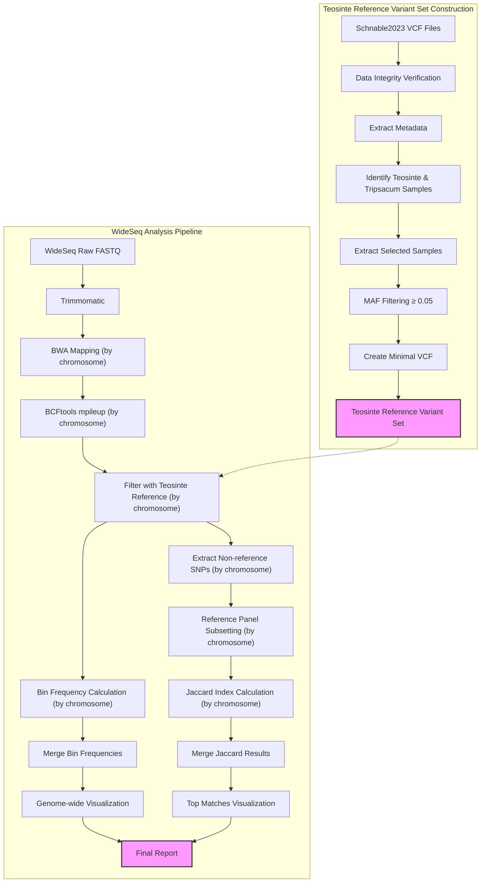

# BzeaSeq: Teosinte Reference Variant Set and WideSeq Analysis

## Table of Contents
- [1. Overview](#1-overview)
- [2. Directory Structure](#2-directory-structure)
- [3. Workflow Diagram](#3-workflow-diagram)
- [4. Teosinte Reference Variant Set Construction](#4-teosinte-reference-variant-set-construction)
  - [4.1 Background](#41-background)
  - [4.2 Data Acquisition](#42-data-acquisition)
  - [4.3 Data Exploration and Preparation](#43-data-exploration-and-preparation)
  - [4.4 Data Processing Pipeline](#44-data-processing-pipeline)
- [5. Integration with WideSeq Analysis](#5-integration-with-wideseq-analysis)
- [6. References](#6-references)

This repository contains pipelines for constructing a Teosinte reference variant set from the Schnable2023 dataset and performing ancestry segment calling using the WideSeq approach.

## 1. Overview

This project consists of two main pipelines:

1. **Teosinte Reference Variant Set Construction**: Processes variant data from teosinte samples in the Schnable2023 study, including sample filtering based on taxonomy and variant filtering based on minor allele frequency.

2. **WideSeq Analysis Pipeline**: Processes WideSeq data to identify ancestry segments by aligning to B73, calling SNPs, comparing to the teosinte reference variant set, and calculating bin frequencies and haplotype similarities.

Both pipelines are optimized for high-performance computing environments using LSF job scheduling.

## 2. Directory Structure

- `scripts/`: Contains all pipeline scripts
  - `teosinte_variants/`: Scripts for processing Schnable2023 teosinte variants
  - `wideseq/`: Scripts for WideSeq ancestry segment calling
  - `utilities/`: Helper scripts for monitoring and job management
- `data/`: Input data
  - `reference/`: B73 reference genome (v5)
  - `schnable2023/`: Schnable2023 variant data
  - `wideseq_fastq/`: WideSeq sequencing data
- `results/`: Pipeline outputs
- `logs/`: Log files from pipeline runs
- `envs/`: Conda environment files
- `docs/`: Documentation

## 3. Workflow Diagram



## 4. Teosinte Reference Variant Set Construction

### 4.1 Background

The Schnable2023 study published in The Plant Journal ("Exploring the pan-genome of the *Zea* genus through genome-wide association studies") includes variant data from both maize and teosinte samples already mapped to the B73 reference genome version 5 (`Zm-B73-REFERENCE-NAM-5.0`). This eliminates the need for liftover from v4 to v5 that was required for the Chen2022 dataset.
> **Note**: For information on processing the Chen2022 dataset, refer to [Chen2022_Processing.md](Chen2022_Processing.md).

### 4.2 Data Acquisition

The VCF files are distributed across 10 chromosome-specific files and are available from the SNPVersity 2.0 repository.

#### 4.2.1 Download Script

```bash
#!/bin/bash
# download_schnable2023_SNPs.sh
#
# Downloads VCF files for all 10 chromosomes from the Schnable2023 dataset.
# Includes MD5 checksum verification after download.

# --- Configuration ---
OUTPUT_DIR="./schnable2023"
CHECKSUMS_FILE="checksums.tab"

# Create output directory if it doesn't exist
mkdir -p ${OUTPUT_DIR}

# Process each chromosome
for chr in {1..10}; do
    echo "Downloading chromosome ${chr} VCF file..."
    
    # Extract download URL and MD5 checksum from checksums file
    URL=$(grep "schnable2023_chr${chr}.vcf.gz" ${CHECKSUMS_FILE} | awk -F'\t' '{print $6}')
    EXPECTED_MD5=$(grep "schnable2023_chr${chr}.vcf.gz" ${CHECKSUMS_FILE} | awk -F'\t' '{print $5}')
    
    if [ -z "${URL}" ] || [ -z "${EXPECTED_MD5}" ]; then
        echo "Error: Could not find URL or MD5 for chromosome ${chr}"
        continue
    fi
    
    OUTFILE="${OUTPUT_DIR}/schnable2023_chr${chr}.vcf.gz"
    
    # Download the file
    curl -L -o ${OUTFILE} ${URL}
    
    # Verify MD5 checksum
    ACTUAL_MD5=$(md5sum ${OUTFILE} | awk '{print $1}')
    
    if [ "${ACTUAL_MD5}" = "${EXPECTED_MD5}" ]; then
        echo "Verification successful for chromosome ${chr}"
    else
        echo "Verification failed for chromosome ${chr}"
        echo "Expected: ${EXPECTED_MD5}"
        echo "Actual: ${ACTUAL_MD5}"
    fi
done

echo "Download completed."
```

#### 4.2.2 File Naming Considerations

When working with the Schnable2023 dataset, you may encounter files with inconsistent naming. Some files may have typos in the prefix (e.g., `schanble2023` instead of `schnable2023`). For consistent pipeline processing, these naming issues need to be corrected using bash parameter substitution:

```bash
# Fix file naming inconsistencies using bash parameter substitution
for file in schanble2023_*.vcf.gz; do 
    mv -v "$file" "${file/schanble/schnable}"
done
```

This command will automatically replace all instances of "schanble" with "schnable" in the filenames, ensuring consistent naming throughout the dataset.

### 4.3 Data Exploration and Preparation

#### 4.3.1 Sample and Variant Statistics

To understand the dataset composition, we can examine the number of samples and variants:

```bash
# Count total samples in the dataset
bcftools query -l schnable2023/schnable2023_chr10.vcf.gz | wc -l

# Generate a complete sample list
bcftools query -l schnable2023/schnable2023_chr10.vcf.gz > schnable2023_id.list

# Get basic statistics for one chromosome
bcftools stats schnable2023/schnable2023_chr10.vcf.gz > schnable2023_chr10.stats
```

#### 4.3.2 Metadata Analysis for Teosinte Sample Selection

> **Note on Metadata**: The metadata for the Schnable2023 dataset was obtained from the supplementary materials in the original publication and manually curated to correct multiple typos, species name inconsistencies, and formatting issues.

Analyze the metadata to identify teosinte and Tripsacum samples:

```bash
# Fix metadata filename if needed
mv schnable2023/schanble2023_metadata.tab schnable2023/schnable2023_metadata.tab

# Extract non-maize samples from metadata
grep -v "Z. mays subsp. mays" schnable2023/schnable2023_metadata.tab > non_maize_samples.tab

# Count species distribution
grep -v "Z. mays subsp. mays" schnable2023/schnable2023_metadata.tab | cut -f2 | grep -v "Species" | sort | uniq -c

# Create sample lists for each teosinte group
grep "Z. mays subsp. mexicana" schnable2023/schnable2023_metadata.tab | cut -f1 > mexicana_samples.list
grep "Z. mays subsp. parviglumis" schnable2023/schnable2023_metadata.tab | cut -f1 > parviglumis_samples.list
grep "Z. diploperennis" schnable2023/schnable2023_metadata.tab | cut -f1 > diploperennis_samples.list
grep "Z. luxurians" schnable2023/schnable2023_metadata.tab | cut -f1 > luxurians_samples.list
grep "Z. nicaraguensis" schnable2023/schnable2023_metadata.tab | cut -f1 > nicaraguensis_samples.list
grep "Z. perennis" schnable2023/schnable2023_metadata.tab | cut -f1 > perennis_samples.list
grep "Tripsacum" schnable2023/schnable2023_metadata.tab | cut -f1 > tripsacum_samples.list

# Create a unified teosinte reference sample list
cat mexicana_samples.list parviglumis_samples.list diploperennis_samples.list \
    luxurians_samples.list nicaraguensis_samples.list perennis_samples.list \
    tripsacum_samples.list > teosinte_samples.list

# Add B73 to the reference sample list
grep "B73" schnable2023/schnable2023_metadata.tab | cut -f1 >> teosinte_samples.list

# Create a final sorted and deduplicated sample list
sort teosinte_samples.list | uniq > teosinte_ref_samples.list
```

#### 4.3.3 Comparison with Chen2022 Dataset

Identify overlapping samples between Schnable2023 and Chen2022:

```bash
# Check which Chen2022 samples are in Schnable2023
grep -w -f chen2022_id.list schnable2023_id.list > overlapping_samples.list
grep -w -f chen2022_id.list schnable2023_id.list | wc -l

# Check which reference samples are in Schnable2023
grep -w -f wideseq_ref_id.list schnable2023_id.list | wc -l
```

### 4.4 Data Processing Pipeline

#### 4.4.1 Sample Extraction and Filtering

Create a script to extract the teosinte samples and apply MAF filtering:

```bash
#!/bin/bash
# process_teosinte_variants.sh
#
# Extracts teosinte and Tripsacum samples from Schnable2023 VCF files
# and applies MAF filtering.

INPUT_DIR="./schnable2023"
OUTPUT_DIR="./teosinte_variants"
SAMPLE_LIST="teosinte_ref_samples.list"
MAF_THRESHOLD="0.05"

# Create output directory
mkdir -p ${OUTPUT_DIR}

# Process each chromosome
for chr in {1..10}; do
    echo "Processing chromosome ${chr}..."
    
    # Input and output file paths
    INPUT_VCF="${INPUT_DIR}/schnable2023_chr${chr}.vcf.gz"
    OUTPUT_VCF="${OUTPUT_DIR}/teosinte_chr${chr}.vcf.gz"
    
    # Extract samples and apply MAF filtering
    bcftools view -S ${SAMPLE_LIST} --min-af ${MAF_THRESHOLD}:minor ${INPUT_VCF} -Oz -o ${OUTPUT_VCF}
    
    # Index the output file
    bcftools index ${OUTPUT_VCF}
    
    echo "Completed chromosome ${chr}"
done

echo "All chromosomes processed."
```

#### 4.4.2 Creating Minimal VCF Files

To reduce file sizes and simplify processing, create minimal VCF files containing only genotype (GT) information:

```bash
#!/bin/bash
# create_minimal_vcf.sh
#
# Creates minimal VCF files containing only GT information from the
# filtered teosinte variants.

INPUT_DIR="./teosinte_variants"
OUTPUT_DIR="./teosinte_minimal_vcf"

# Create output directory
mkdir -p ${OUTPUT_DIR}

# Create a minimal header template
cat > ${OUTPUT_DIR}/minimal_header.txt << EOL
##fileformat=VCFv4.2
##FORMAT=<ID=GT,Number=1,Type=String,Description="Genotype">
EOL

# Process each chromosome
for chr in {1..10}; do
    echo "Processing chromosome ${chr}..."
    
    # Input and output file paths
    INPUT_VCF="${INPUT_DIR}/teosinte_chr${chr}.vcf.gz"
    OUTPUT_VCF="${OUTPUT_DIR}/teosinte_chr${chr}.minimal.vcf.gz"
    
    # Extract contig lines from the original header
    bcftools view -h ${INPUT_VCF} | grep "^##contig" > ${OUTPUT_DIR}/contigs_${chr}.txt
    
    # Extract samples line from the header
    bcftools view -h ${INPUT_VCF} | grep "^#CHROM" > ${OUTPUT_DIR}/samples_${chr}.txt
    
    # Create complete header for this chromosome
    cat ${OUTPUT_DIR}/minimal_header.txt ${OUTPUT_DIR}/contigs_${chr}.txt ${OUTPUT_DIR}/samples_${chr}.txt > ${OUTPUT_DIR}/header_${chr}.txt
    
    # Remove all INFO fields and FORMAT fields except GT
    bcftools annotate -x INFO,^FORMAT/GT ${INPUT_VCF} -Ov -o ${OUTPUT_DIR}/data_${chr}.vcf
    
    # Replace header with minimal header
    bcftools reheader -h ${OUTPUT_DIR}/header_${chr}.txt ${OUTPUT_DIR}/data_${chr}.vcf | \
    bcftools view -Oz -o ${OUTPUT_VCF}
    
    # Index the output file
    bcftools index ${OUTPUT_VCF}
    
    # Clean up temporary files
    rm ${OUTPUT_DIR}/contigs_${chr}.txt ${OUTPUT_DIR}/samples_${chr}.txt ${OUTPUT_DIR}/header_${chr}.txt ${OUTPUT_DIR}/data_${chr}.vcf
    
    echo "Completed chromosome ${chr}"
done

# Clean up remaining temporary files
rm ${OUTPUT_DIR}/minimal_header.txt

echo "All files processed successfully."
```

#### 4.4.3 Variant Statistics

Calculate statistics for the filtered variants to assess their distribution and utility for ancestry analysis:

```bash
#!/bin/bash
# calculate_variant_stats.sh
#
# Calculates statistics for the filtered teosinte variants.

INPUT_DIR="./teosinte_minimal_vcf"
OUTPUT_DIR="./stats"

# Create output directory
mkdir -p ${OUTPUT_DIR}

# Calculate total variants across all chromosomes
total_variants=0

# Process each chromosome
for chr in {1..10}; do
    echo "Calculating statistics for chromosome ${chr}..."
    
    # Input file
    INPUT_VCF="${INPUT_DIR}/teosinte_chr${chr}.minimal.vcf.gz"
    
    # Calculate statistics
    bcftools stats ${INPUT_VCF} > ${OUTPUT_DIR}/teosinte_chr${chr}.stats
    
    # Count variants
    variants=$(grep "number of SNPs:" ${OUTPUT_DIR}/teosinte_chr${chr}.stats | awk '{print $6}')
    total_variants=$((total_variants + variants))
    
    echo "Chromosome ${chr}: ${variants} variants"
done

echo "Total variants across all chromosomes: ${total_variants}"

# Calculate average variant density per 100kb
genome_size=2300000000  # Approximate maize genome size in bp
density_per_100kb=$(echo "scale=2; ${total_variants} * 100000 / ${genome_size}" | bc)

echo "Average variant density: ${density_per_100kb} variants per 100kb"
```

## 5. Integration with WideSeq Analysis

The teosinte reference variant set constructed from Schnable2023 can be directly integrated with the WideSeq analysis pipeline. The B73v5-aligned variants eliminate the need for liftover and ensure compatibility with modern sequencing datasets.

For WideSeq analysis:

1. Use the minimal VCF files as the reference panel for ancestry calling
2. Split the analysis by chromosome for parallel processing
3. Generate bin frequencies and calculate Jaccard indices for similarity analysis
4. Merge results for genome-wide visualization

## 6. References

1. Schnable, J.C., et al. (2023). Exploring the pan-genome of the *Zea* genus through genome-wide association studies. The Plant Journal, 116(1), 225-238. https://doi.org/10.1111/tpj.16123

2. Chen, Q., et al. (2022). Genome sequencing reveals evidence of adaptive variation in the genus *Zea*. Nature Genetics, 54, 1386-1396. https://doi.org/10.1038/s41588-022-01184-y

3. Andorf, C.M., Ross-Ibarra, J., Seetharam, A.S., et al. (2025). A unified VCF dataset from nearly 1,500 diverse maize accessions and resources to explore the genomic landscape of maize. G3 Genes|Genomes|Genetics, 15(2), jkae281. https://doi.org/10.1093/g3journal/jkae281
4. Hufford, M.B., Seetharam, A.S., Woodhouse, M.R., et al. (2021). De novo assembly, annotation, and comparative analysis of 26 diverse maize genomes. Science, 373(6555), 655-662. https://doi.org/10.1126/science.abg5289