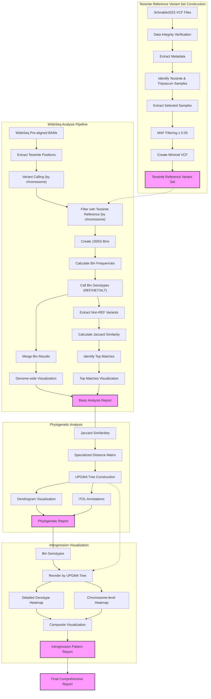

# BzeaSeq: Teosinte Reference Variant Set and WideSeq Analysis

## Table of Contents
- [1. Overview](#1-overview)
- [2. Directory Structure](#2-directory-structure)
- [3. Workflow Diagram](#3-workflow-diagram)
- [4. Teosinte Reference Variant Set Construction](#4-teosinte-reference-variant-set-construction)
  - [4.1 Background](#41-background)
  - [4.2 Data Acquisition](#42-data-acquisition)
  - [4.3 Data Exploration and Preparation](#43-data-exploration-and-preparation)
  - [4.4 Data Processing Pipeline](#44-data-processing-pipeline)
- [5. WideSeq Analysis Pipeline](#5-wideseq-analysis-pipeline)
  - [5.1 Basic Analysis](#51-basic-analysis)
  - [5.2 Ancestry Analysis](#52-ancestry-analysis)
  - [5.3 Phylogenetic Analysis](#53-phylogenetic-analysis)
  - [5.4 Introgression Visualization](#54-introgression-visualization)
- [6. References](#6-references)

This repository contains pipelines for constructing a Teosinte reference variant set from the Schnable2023 dataset and performing ancestry segment calling using the WideSeq approach.

## 1. Overview

This project consists of two main pipelines:

1. **Teosinte Reference Variant Set Construction**: Processes variant data from teosinte samples in the Schnable2023 study, including sample filtering based on taxonomy and variant filtering based on minor allele frequency.

2. **WideSeq Analysis Pipeline**: Processes WideSeq data to identify ancestry segments by aligning to B73, calling SNPs, comparing to the teosinte reference variant set, and calculating bin frequencies and haplotype similarities. Includes advanced phylogenetic analysis and introgression pattern visualization.

Both pipelines are optimized for high-performance computing environments using LSF job scheduling.

## 2. Directory Structure

- `scripts/`: Contains all pipeline scripts
  - `teosinte_variants/`: Scripts for processing Schnable2023 teosinte variants
  - `wideseq/`: Scripts for WideSeq ancestry segment calling
  - `phylogeny/`: Scripts for phylogenetic analysis
  - `visualization/`: Scripts for introgression pattern visualization
  - `utilities/`: Helper scripts for monitoring and job management
- `data/`: Input data
  - `reference/`: B73 reference genome (v5)
  - `schnable2023/`: Schnable2023 variant data
  - `wideseq_fastq/`: WideSeq sequencing data
- `results/`: Pipeline outputs
  - `variants/`: Filtered variant calls
  - `bins/`: Bin-level ancestry calls
  - `jaccard/`: Jaccard similarity results
  - `phylogeny/`: UPGMA tree and distance matrices
  - `heatmaps/`: Introgression pattern visualizations
- `logs/`: Log files from pipeline runs
- `envs/`: Conda environment files
- `docs/`: Documentation

## 3. Workflow Diagram



## 4. Teosinte Reference Variant Set Construction

### 4.1 Background

The Schnable2023 study published in The Plant Journal ("Exploring the pan-genome of the *Zea* genus through genome-wide association studies") includes variant data from both maize and teosinte samples already mapped to the B73 reference genome version 5 (`Zm-B73-REFERENCE-NAM-5.0`). This eliminates the need for liftover from v4 to v5 that was required for the Chen2022 dataset.
> **Note**: For information on processing the Chen2022 dataset, refer to [Chen2022_Processing.md](Chen2022_Processing.md).

### 4.2 Data Acquisition

The VCF files are distributed across 10 chromosome-specific files and are available from the SNPVersity 2.0 repository.

#### 4.2.1 Download Script

```bash
#!/bin/bash
# download_schnable2023_SNPs.sh
#
# Downloads VCF files for all 10 chromosomes from the Schnable2023 dataset.
# Includes MD5 checksum verification after download.

# --- Configuration ---
OUTPUT_DIR="./schnable2023"
CHECKSUMS_FILE="checksums.tab"

# Create output directory if it doesn't exist
mkdir -p ${OUTPUT_DIR}

# Process each chromosome
for chr in {1..10}; do
    echo "Downloading chromosome ${chr} VCF file..."
    
    # Extract download URL and MD5 checksum from checksums file
    URL=$(grep "schnable2023_chr${chr}.vcf.gz" ${CHECKSUMS_FILE} | awk -F'\t' '{print $6}')
    EXPECTED_MD5=$(grep "schnable2023_chr${chr}.vcf.gz" ${CHECKSUMS_FILE} | awk -F'\t' '{print $5}')
    
    if [ -z "${URL}" ] || [ -z "${EXPECTED_MD5}" ]; then
        echo "Error: Could not find URL or MD5 for chromosome ${chr}"
        continue
    fi
    
    OUTFILE="${OUTPUT_DIR}/schnable2023_chr${chr}.vcf.gz"
    
    # Download the file
    curl -L -o ${OUTFILE} ${URL}
    
    # Verify MD5 checksum
    ACTUAL_MD5=$(md5sum ${OUTFILE} | awk '{print $1}')
    
    if [ "${ACTUAL_MD5}" = "${EXPECTED_MD5}" ]; then
        echo "Verification successful for chromosome ${chr}"
    else
        echo "Verification failed for chromosome ${chr}"
        echo "Expected: ${EXPECTED_MD5}"
        echo "Actual: ${ACTUAL_MD5}"
    fi
done

echo "Download completed."
```

#### 4.2.2 File Naming Considerations

When working with the Schnable2023 dataset, you may encounter files with inconsistent naming. Some files may have typos in the prefix (e.g., `schanble2023` instead of `schnable2023`). For consistent pipeline processing, these naming issues need to be corrected using bash parameter substitution:

```bash
# Fix file naming inconsistencies using bash parameter substitution
for file in schanble2023_*.vcf.gz; do 
    mv -v "$file" "${file/schanble/schnable}"
done
```

This command will automatically replace all instances of "schanble" with "schnable" in the filenames, ensuring consistent naming throughout the dataset.

### 4.3 Data Exploration and Preparation

#### 4.3.1 Sample and Variant Statistics

To understand the dataset composition, we can examine the number of samples and variants:

```bash
# Count total samples in the dataset
bcftools query -l schnable2023/schnable2023_chr10.vcf.gz | wc -l

# Generate a complete sample list
bcftools query -l schnable2023/schnable2023_chr10.vcf.gz > schnable2023_id.list

# Get basic statistics for one chromosome
bcftools stats schnable2023/schnable2023_chr10.vcf.gz > schnable2023_chr10.stats
```

#### 4.3.2 Metadata Analysis for Teosinte Sample Selection

> **Note on Metadata**: The metadata for the Schnable2023 dataset was obtained from the supplementary materials in the original publication and manually curated to correct multiple typos, species name inconsistencies, and formatting issues.

Analyze the metadata to identify teosinte and Tripsacum samples:

```bash
# Taxonomic distribution
grep -v "Z. mays" schnable2023/schnable2023_metadata.tab | cut -f2 | grep -v "Species" | sort | uniq -c

# Create wild_relative list
grep -v "Z. mays" schnable2023/schnable2023_metadata.tab | cut -f1 | grep -v "ID">> wild_relatives_id.list

# Add B73 to the reference sample list
grep "B73" schnable2023/schnable2023_metadata.tab \
  | cut -f1 | cat - wild_relatives_id.list \
  | sort| uniq >  wideseq_ref_id.list      # Create a final sorted and deduplicated sample list
```

#### 4.3.3 Comparison with Chen2022 Dataset

Identify overlapping samples between Schnable2023 and Chen2022:

```bash
# Check which Chen2022 samples are in Schnable2023
grep -w -f chen2022_id.list schnable2023_id.list | wc -l

# Check which reference samples are in Schnable2023
grep -w -f wideseq_ref_id.list schnable2023_id.list | wc -l
```

### 4.4 Data Processing Pipeline

#### 4.4.1 Sample Extraction and Filtering

Create a script to extract the teosinte samples and apply MAF filtering:

```bash
#!/bin/bash
# get_variants_from_schnable2023.sh
#
# Extracts teosinte and Tripsacum samples from Schnable2023 VCF files
# and applies MAF filtering.

INPUT_DIR="./schnable2023"
OUTPUT_DIR="./wideseq_ref"
SAMPLE_LIST="wideseq_ref_id.list"

# This will bias against huehue 
MAF_THRESHOLD="0.05"

# Create output directory
mkdir -p ${OUTPUT_DIR}

# Process each chromosome
for chr in {1..10}; do
    echo "Processing chromosome ${chr}..."
    
    # Input and output file paths
    INPUT_VCF="${INPUT_DIR}/schnable2023_chr${chr}.vcf.gz"
    OUTPUT_VCF="${OUTPUT_DIR}/wideseq_chr${chr}.vcf.gz"
    
    # Extract samples and apply MAF filtering
    bcftools view -S ${SAMPLE_LIST} --min-af ${MAF_THRESHOLD}:minor ${INPUT_VCF} -Oz -o ${OUTPUT_VCF}
    
    # Index the output file
    bcftools index ${OUTPUT_VCF}
    
    echo "Completed chromosome ${chr}"
done

echo "All chromosomes processed."
```

#### 4.4.3 Variant Statistics

Calculate statistics for the filtered variants to assess their distribution and utility for ancestry analysis:

```bash
#!/bin/bash
# calculate_variant_stats.sh
#
# Calculates statistics for the filtered teosinte variants.

INPUT_DIR="./wideseq_ref"
OUTPUT_DIR="./stats"

# Create output directory
mkdir -p ${OUTPUT_DIR}

# Calculate total variants across all chromosomes
total_variants=0

# Process each chromosome
for chr in {1..10}; do
    echo "Calculating statistics for chromosome ${chr}..."
    
    # Input file
    INPUT_VCF="${INPUT_DIR}/wideseq_chr${chr}.vcf.gz"
    
    # Calculate statistics
    bcftools stats ${INPUT_VCF} > ${OUTPUT_DIR}/wideseq_chr${chr}.stats
    
    # Count variants
    variants=$(grep "number of SNPs:" ${OUTPUT_DIR}/wideseq_chr${chr}.stats | awk '{print $6}')
    total_variants=$((total_variants + variants))
    
    echo "Chromosome ${chr}: ${variants} variants"
done

echo "Total variants across all chromosomes: ${total_variants}"

# Calculate average variant density per 100kb
genome_size=2131846805  # Zm-B73-REFERENCE-NAM-5.0 nuclear chromosome length in bp
density_per_100kb=$(echo "scale=2; ${total_variants} * 100000 / ${genome_size}" | bc)

echo "Average variant density: ${density_per_100kb} variants per 100kb"
```

Giving the following output:
```
Calculating statistics for chromosome 1...
Chromosome 1: 4014996 variants
Calculating statistics for chromosome 2...
Chromosome 2: 3107336 variants
Calculating statistics for chromosome 3...
Chromosome 3: 3134513 variants
Calculating statistics for chromosome 4...
Chromosome 4: 3536756 variants
Calculating statistics for chromosome 5...
Chromosome 5: 2884437 variants
Calculating statistics for chromosome 6...
Chromosome 6: 2148207 variants
Calculating statistics for chromosome 7...
Chromosome 7: 2304091 variants
Calculating statistics for chromosome 8...
Chromosome 8: 2287674 variants
Calculating statistics for chromosome 9...
Chromosome 9: 2185739 variants
Calculating statistics for chromosome 10...
Chromosome 10: 2058789 variants
Total variants across all chromosomes: 27662538
Average variant density: 1297.58 variants per 100kb
```

## 5. WideSeq Analysis Pipeline

### 5.1 Basic Analysis

The WideSeq analysis pipeline processes pre-aligned BAM files to identify ancestry segments by comparing to the teosinte reference variant set.

#### 5.1.1 Variant Calling and Filtering

The pipeline starts by calling variants from pre-aligned BAM files and filtering them against the teosinte reference panel:

```bash
# Call variants for each chromosome
bcftools mpileup -f ${REFERENCE_DIR}/Zm-B73-REFERENCE-NAM-5.0.fa \
    -r ${chrom} ${SORTED_BAMS_DIR}/${sample}.bam | \
    bcftools call -m -Oz -o ${OUTPUT_DIR}/variants/${sample}.${chrom}.vcf.gz

# Filter variants to those in the teosinte panel
bcftools view -T ${OUTPUT_DIR}/variants/teosinte_${chrom}_positions.txt \
    ${OUTPUT_DIR}/variants/${sample}.${chrom}.vcf.gz \
    -Oz -o ${OUTPUT_DIR}/filtered/${sample}.${chrom}.filtered.vcf.gz
```

#### 5.1.2 Bin Creation and Genotype Calling

Next, the pipeline creates 100Kb bins across the genome and calculates allele frequencies within each bin:

```bash
# Create 100Kb bins
bedtools makewindows -g <(echo -e "${chrom}\t${chr_size}") -w 100000 \
    > ${OUTPUT_DIR}/bins/${sample}.${chrom}.bins.bed

# Calculate bin frequencies
bedtools map -a ${OUTPUT_DIR}/bins/${sample}.${chrom}.bins.bed \
    -b ${OUTPUT_DIR}/bins/${sample}.${chrom}.variants.bed \
    -c 6 -o collapse > ${OUTPUT_DIR}/bins/${sample}.${chrom}.gt_per_bin.txt
```

The pipeline then processes these frequencies to call genotypes for each bin:
- **REF**: ≥70% reference allele frequency
- **HET**: Mixed reference/alternate alleles
- **ALT**: ≥70% alternate allele frequency
- **NO_DATA**: Insufficient variants for classification

#### 5.1.3 Jaccard Similarity Calculation

For regions with non-reference genotypes (HET or ALT), the pipeline calculates Jaccard similarity with teosinte accessions:

```bash
# Extract non-reference variants
bedtools intersect -a ${OUTPUT_DIR}/bins/${sample}.${chrom}.variants.bed \
    -b ${OUTPUT_DIR}/bins/${sample}.${chrom}.non_ref_bins.bed \
    > ${OUTPUT_DIR}/bins/${sample}.${chrom}.non_ref_variants.bed

# Calculate Jaccard similarity with teosinte panel
# (Code for Jaccard calculation implemented in Python)
```

### 5.2 Ancestry Analysis

The basic analysis results are combined to produce ancestry insights:

1. **Bin-level Ancestry Calls**: Genome-wide map of bin genotypes (REF/HET/ALT)
2. **Top Matches**: Identification of teosinte accessions with highest similarity
3. **Chromosome-level Statistics**: Distribution of ancestry segments by chromosome
4. **Visualization**: Genome-wide plots of ancestry segments

### 5.3 Phylogenetic Analysis

The WideSeq pipeline includes advanced phylogenetic analysis to understand evolutionary relationships:

#### 5.3.1 Specialized Distance Matrix

A specialized distance matrix is calculated with different methods depending on comparison type:

1. **Teosinte-to-Teosinte distances**: Calculated using all markers
2. **NIL-to-NIL distances**: Calculated using all markers
3. **NIL-to-Teosinte distances**: Calculated using only markers in NON-REF bins of each NIL

```bash
# Calculate specialized distance matrix
# (Implemented in Python with three distinct calculation methods)
```

#### 5.3.2 UPGMA Tree Construction

The specialized distance matrix is used to construct a UPGMA (Unweighted Pair Group Method with Arithmetic Mean) tree:

```bash
# Compute linkage matrix using UPGMA (average linkage)
Z = linkage(condensed_dist, method='average')

# Apply optimal leaf ordering
Z_ordered = optimal_leaf_ordering(Z, condensed_dist)
```

#### 5.3.3 Tree Visualization and Export

The resulting tree is visualized and exported in various formats:

```bash
# Generate dendrogram visualization
dendrogram(Z_ordered, labels=sample_names, ...)

# Export Newick format for external tools
# (Code to generate Newick format)

# Create iTOL annotation files for interactive visualization
# (Code to generate iTOL annotations)
```

### 5.4 Introgression Visualization

The final step is creating detailed visualizations of introgression patterns:

#### 5.4.1 Genotype Heatmap Ordered by UPGMA

The bin genotypes are visualized as a heatmap, with samples ordered according to the UPGMA tree:

```bash
# Reorder samples based on UPGMA clustering
ordered_indices = leaves_list(Z_ordered)
ordered_samples = [sample_names[i] for i in ordered_indices]

# Create detailed genotype heatmap
# (Code to generate detailed heatmap with samples in UPGMA order)
```

#### 5.4.2 Chromosome-level Aggregation

For a higher-level overview, bin genotypes are aggregated by chromosome:

```bash
# Calculate NON-REF bin percentage by chromosome
# (Code to aggregate bin genotypes by chromosome)

# Create chromosome-level heatmap
# (Code to generate chromosome-level heatmap)
```

#### 5.4.3 Composite Visualization

A composite visualization combines the UPGMA dendrogram with the chromosome-level heatmap:

```bash
# Create composite visualization
# (Code to create a figure with both dendrogram and heatmap)
```

This comprehensive visualization reveals how evolutionary relationships correlate with introgression patterns across the genome.

## 6. References

1. Schnable, J.C., et al. (2023). Exploring the pan-genome of the *Zea* genus through genome-wide association studies. The Plant Journal, 116(1), 225-238. https://doi.org/10.1111/tpj.16123

2. Chen, Q., et al. (2022). Genome sequencing reveals evidence of adaptive variation in the genus *Zea*. Nature Genetics, 54, 1386-1396. https://doi.org/10.1038/s41588-022-01184-y

3. Andorf, C.M., Ross-Ibarra, J., Seetharam, A.S., et al. (2025). A unified VCF dataset from nearly 1,500 diverse maize accessions and resources to explore the genomic landscape of maize. G3 Genes|Genomes|Genetics, 15(2), jkae281. https://doi.org/10.1093/g3journal/jkae281

4. Hufford, M.B., Seetharam, A.S., Woodhouse, M.R., et al. (2021). De novo assembly, annotation, and comparative analysis of 26 diverse maize genomes. Science, 373(6555), 655-662. https://doi.org/10.1126/science.abg5289