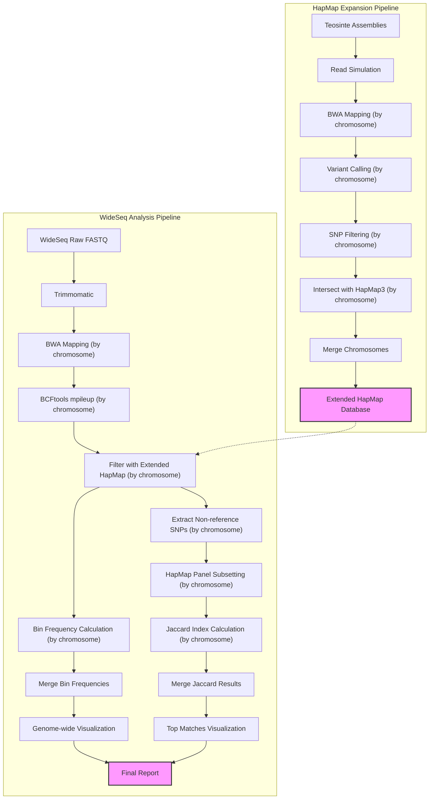

# BzeaSeq: Teosinte HapMap Integration and WideSeq Analysis

This repository contains pipelines for integrating Teosinte relatives into the HapMap3 SNP database and performing ancestry segment calling using the WideSeq approach.

## 1. Overview

This project consists of two main pipelines:

1. **HapMap Expansion Pipeline**: Simulates short reads from Teosinte relative assemblies, aligns them to the B73 reference, calls SNPs, and integrates them with HapMap3.

2. **WideSeq Analysis Pipeline**: Processes WideSeq data to identify ancestry segments by aligning to B73, calling SNPs, comparing to HapMap3, and calculating bin frequencies and haplotype similarities.

Both pipelines are optimized for high-performance computing environments using LSF job scheduling.

## 2. Directory Structure

- `scripts/`: Contains all pipeline scripts
  - `hapmap_expansion/`: Scripts for HapMap3 expansion pipeline
  - `wideseq/`: Scripts for WideSeq ancestry segment calling
  - `utilities/`: Helper scripts for monitoring and job management
- `data/`: Input data
  - `reference/`: B73 reference genome
  - `wild_relatives/`: Wild relative genome assemblies
  - `wideseq_fastq/`: WideSeq sequencing data
  - `hapmap/`: HapMap3 VCF files
- `results/`: Pipeline outputs
- `logs/`: Log files from pipeline runs
- `envs/`: Conda environment files
- `docs/`: Documentation

## 3. Workflow Diagram



## Incorporating Teosinte (Wild Maize) Variants from Chen 2022

### Background

The Chen 2022 study published in Nature ("Genome sequencing reveals evidence of adaptive variation in the genus *Zea*") includes approximately 75 million SNPs from teosinte samples in B73 reference genome version 4. The plan is to download these samples and lift them over to reference genome version 5 for integration into the WideSeq pipeline.

### Data Acquisition

The SNP data is distributed across multiple files named `merge_1.filter.vcf.gz` through `merge_10.filter.vcf.gz` and is available from the Chinese National GeneBank (CNGB).

#### Download Script

The script below uses Aspera to download the SNP files. It includes checks to avoid re-downloading files that already exist locally:

```bash
#!/bin/bash
# download_chen2022_SNPs.sh 
# downloading data from https://ftp.cngb.org/pub/CNSA/data3/CNP0001565/zeamap/02_Variants/PAN_Zea_Variants/Zea-vardb/

# --- Configuration ---
KEY_FILE="aspera_download.key"
KEY_URL="ftp://ftp.cngb.org/pub/Tool/Aspera/aspera_download.key"
REMOTE_USER_HOST="aspera_download@183.239.175.39"
REMOTE_BASE_DIR="/pub/CNSA/data3/CNP0001565/zeamap/02_Variants/PAN_Zea_Variants/Zea-vardb"
ASCP_PORT="33001"
ASCP_RATE="100m"  # Max transfer rate
ASCP_OPTS="-T -k 1"  # Disable encryption, enable resume
LOCAL_DEST_DIR="./"  # Download to the current directory
START_NUM=1
END_NUM=10
# --- End Configuration ---

# Function for logging messages
log() {
    echo "$(date '+%Y-%m-%d %H:%M:%S') - $1"
}

# 1. Download the Aspera key file if it doesn't exist
if [ -f "${KEY_FILE}" ]; then
    log "Aspera key file '${KEY_FILE}' already exists, skipping download."
else
    log "Attempting to download Aspera key from ${KEY_URL}..."
    curl -o "${KEY_FILE}" -s "${KEY_URL}"
    
    # Check if curl command failed (exit status non-zero)
    if [ $? -ne 0 ]; then
        log "ERROR: Failed to download the Aspera key file using curl. Please check network connection and URL."
        exit 1
    fi
    
    # Check if the key file actually exists after curl command
    if [ ! -f "${KEY_FILE}" ]; then
        log "ERROR: Aspera key file '${KEY_FILE}' not found after download attempt. Curl might have failed silently."
        exit 1
    fi
    
    log "Aspera key file '${KEY_FILE}' downloaded successfully."
fi

# 2. Loop through the file numbers and download using ascp
log "Starting downloads from ${START_NUM} to ${END_NUM}..."
for i in $(seq ${START_NUM} ${END_NUM})
do
    # Construct the full remote file path
    REMOTE_FILE_PATH="${REMOTE_USER_HOST}:${REMOTE_BASE_DIR}/merge_${i}.filter.vcf.gz"
    LOCAL_FILENAME="merge_${i}.filter.vcf.gz"
    LOCAL_FILE_PATH="${LOCAL_DEST_DIR}/${LOCAL_FILENAME}"
    
    # Check if the file already exists
    if [ -f "${LOCAL_FILE_PATH}" ]; then
        log "File ${LOCAL_FILENAME} already exists locally. Skipping download."
        continue
    fi
    
    # Just the filename for logging
    log "Initiating download for ${LOCAL_FILENAME}..."
    
    # Execute the ascp command
    ascp -i "${KEY_FILE}" -P "${ASCP_PORT}" ${ASCP_OPTS} -l "${ASCP_RATE}" "${REMOTE_FILE_PATH}" "${LOCAL_DEST_DIR}"
    
    # Check the exit status of the ascp command
    if [ $? -eq 0 ]; then
        log "Successfully downloaded ${LOCAL_FILENAME}."
    else
        log "WARNING: Failed to download ${LOCAL_FILENAME}. Check ascp output/logs for details. Continuing with next file..."
        # If you want the script to stop on the first error, uncomment the next line:
        # exit 1
    fi
done

log "All download attempts finished."

# Optional: Clean up the key file if desired
# log "Removing key file '${KEY_FILE}'."
# rm -f "${KEY_FILE}"

exit 0
```

### Data Exploration and Preparation

#### Sample and Variant Statistics

To verify the downloaded data, we can examine the number of samples and variants:

```bash
bcftools query -l ../Zea-vardb/merge_10.filter.vcf.gz| wc -l
```

```
744
```

```bash
bcftools stats ../Zea-vardb/merge_10.filter.vcf.gz > merge_10.filter.stats
more merge_10.filter.stats
```

```
SN	0	number of samples:	744
SN	0	number of records:	5055237
SN	0	number of no-ALTs:	0
SN	0	number of SNPs:	5055237
SN	0	number of MNPs:	0
SN	0	number of indels:	0
SN	0	number of others:	0
SN	0	number of multiallelic sites:	319084
SN	0	number of multiallelic SNP sites:	319084
```

The statistics show 744 samples and over 5 million SNPs in chromosome 10 alone, confirming the dataset should contain more than 70 million SNPs across all chromosomes.

#### Reference Genotype Confirmation

We confirmed that B73 (the reference genotype) is included in the dataset:

```bash
grep B73 chen2022_passport.tab
```

```
B73	-	-	-	285169576	277505548	97.31 	97.47 	19.72 	60259366	21.13 	-	-	Zea mays subsp. mays	Zea mays subsp. mays (TEM)
```

#### Teosinte Sample Analysis

The dataset contains 238 teosinte samples (non-maize subspecies and non-Tripsacum):

```bash
grep -v "subsp. mays" chen2022_passport.tab | grep -v "Tripsacum" | wc -l
```

```
238
```

The taxonomic breakdown of teosinte samples is as follows:

```bash
grep -v "subsp. mays" chen2022_passport.tab | grep -v "Tripsacum"| cut -f 15|  sort |uniq -c
```

```
      1 New taxonomyb
     14 Teosinte (mix)
     20 Zea diploperennis
     14 Zea luxurians
      5 Zea mays subsp. huehuetenangensis
     81 Zea mays subsp. mexicana
     70 Zea mays subsp. parviglumis
     14 Zea nicaraguensis
     19 Zea perennis
```

#### Sample Selection for Analysis

To prepare for downstream analysis, we selected teosinte samples and the B73 reference:

```bash
tail -n +2 chen2022_passport.tab| grep -v "subsp. mays"  |grep -v "Tripsacum"| cut -f1 > teosinte_id.list
grep B73 chen2022_passport.tab | cut -f1 >  B73_id.list
cat B73_id.list teosinte_id.list > wideseq_ref_id.list
more wideseq_ref_id.list
```

### Downstream Processing Plan

The next steps in the analysis pipeline are:

1. **Filter VCF Files**:
   - Select only samples from `wideseq_ref_id.list`
   - Remove non-variant sites using bcftools

   ```bash
   # Example command to filter samples and variants
   bcftools view -q 0.05:minor  -S wideseq_ref_id.list --min-ac=1 ../Zea-vardb/merge_10.filter.vcf.gz  -o ../Zea-vardb/chr1.wideseq.v4.vcf.gz
   ```
```
Contig '10' is not defined in the header. (Quick workaround: index the file with tabix.)
```
I need just the positions for my analysis I am not doing further filtering from sample stats like DP.
I  have the correct headers in `chen2022_vcf_header.txt`
The names in `Zm-B73-REFERENCE-GRAMENE-4.0` are Chr1...Chr10, i need to change the names and reindex
The names in `B73_RefGen_v4_to_Zm-B73-REFERENCE-NAM-5.0` are chr1...chr10
I need to make those names and the names in the chain file `B73_RefGen_v4_to_Zm-B73-REFERENCE-NAM-5.0.chain`
compatible.
the chainfiles used to be broken for reading with the R package "liftOver" and need to change spaces to tabs
```bash
perl -i -pe ' if ( $_ !~ /chain/) {s/ +/\t/g}' B73_RefGen_v4_to_Zm-B73-REFERENCE-NAM-5.0.chain
```

probably I'll use  need `LiftoverVcf` from picard

```
picard LiftoverVcf \\
     I=input.vcf \\
     O=lifted_over.vcf \\
     CHAIN=B73_RefGen_v4_to_Zm-B73-REFERENCE-NAM-5.0.chain \\
     REJECT=rejected_variants.vcf \\
     R=reference_sequence.fasta
```

The chromosomes in this file are just numbers I need to change the to be compatible with v5

I need to add replace the header with this one.
80% of the variants have MAF < 0.05
If I filter for this I'll get 5.6e+07 variants, i.e one snp every 40 bp. Way more than I need.
2500 per 100kb window.

Or export to hapmap then back to vcf?
So I export just the genotype field to reduce the vcf size.


```
bcftools query -s wideseq_ref_id.list \
      -f '%CHROM\t%POS\t%ID\t%REF\t%ALT\t%QUAL\t%FILTER\tGT[\t%GT]\n' \
      ../Zea-vardb/merge_${i}.filter.vcf.gz

```
```
picard FixVcfHeader \
     --CHECK_FIRST_N_RECORDS 1000\
     -I ../Zea-vardb/merge_10.filter.vcf.gz \
     -O ../Zea-vardb/merge_10.header.vcf.gz
```

2. **Genomic Coordinate Conversion**:
   - Lift over variants from B73 reference v4 to v5
   - Use chain file: `B73_RefGen_v4_to_Zm-B73-REFERENCE-NAM-5.0.chain`
 # 
 

   ```bash
   # Example liftover command using CrossMap
   CrossMap.py vcf B73_RefGen_v4_to_Zm-B73-REFERENCE-NAM-5.0.chain filtered/merge_1.teosinte.vcf.gz B73v5.fa lifted/merge_1.teosinte.v5.vcf
   ```

3. **VCF Files Inspection**:

   ```bash
   bcftools head ../Zea-vardb/merge_10.filter.vcf.gz
   ```

4. **Integration with WideSeq Pipeline**:
   - Process the lifted-over variants through the standard WideSeq workflow
   - Merge with existing WideSeq data if applicable

### References

Chen, Q., Lu, Y., Yang, Y. et al. Genome sequencing reveals evidence of adaptive variation in the genus Zea. Nat Genet 54, 1386–1396 (2022). https://doi.org/10.1038/s41588-022-01184-y


