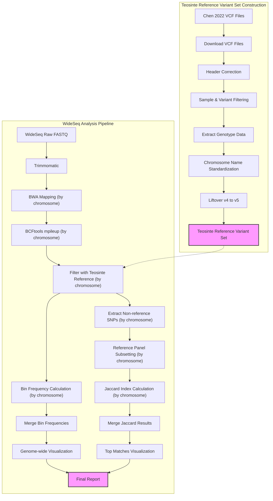

# BzeaSeq: Teosinte Reference Variant Set and WideSeq Analysis

## Table of Contents
- [1. Overview](#1-overview)
- [2. Directory Structure](#2-directory-structure)
- [3. Workflow Diagram](#3-workflow-diagram)
- [4. Teosinte Reference Variant Set Construction](#4-teosinte-reference-variant-set-construction)
  - [4.1 Background](#41-background)
  - [4.2 Data Acquisition](#42-data-acquisition)
  - [4.3 Data Exploration and Preparation](#43-data-exploration-and-preparation)
  - [4.4 Data Processing Pipeline](#44-data-processing-pipeline)
- [5. References](#5-references)

This repository contains pipelines for constructing a Teosinte reference variant set from the Chen 2022 dataset and performing ancestry segment calling using the WideSeq approach.

## 1. Overview

This project consists of two main pipelines:

1. **Teosinte Reference Variant Set Construction**: Downloads and processes large-scale variant data from teosinte samples in the Chen 2022 study, including header correction, filtering, and liftover from B73v4 to B73v5 reference.

2. **WideSeq Analysis Pipeline**: Processes WideSeq data to identify ancestry segments by aligning to B73, calling SNPs, comparing to the teosinte reference variant set, and calculating bin frequencies and haplotype similarities.

Both pipelines are optimized for high-performance computing environments using LSF job scheduling.

## 2. Directory Structure

- `scripts/`: Contains all pipeline scripts
  - `teosinte_variants/`: Scripts for processing Chen 2022 teosinte variants
  - `wideseq/`: Scripts for WideSeq ancestry segment calling
  - `utilities/`: Helper scripts for monitoring and job management
- `data/`: Input data
  - `reference/`: B73 reference genome (v4 and v5)
  - `chen2022/`: Chen 2022 teosinte variant data
  - `wideseq_fastq/`: WideSeq sequencing data
- `results/`: Pipeline outputs
- `logs/`: Log files from pipeline runs
- `envs/`: Conda environment files
- `docs/`: Documentation

## 3. Workflow Diagram



## 4. Teosinte Reference Variant Set Construction

### 4.1 Background

The Chen 2022 study published in Nature ("Genome sequencing reveals evidence of adaptive variation in the genus *Zea*") includes approximately 75 million SNPs from teosinte samples in B73 reference genome version 4. The plan is to download these samples and lift them over to reference genome version 5 for integration into the WideSeq pipeline.

### 4.2 Data Acquisition

The SNP data is distributed across multiple files named `merge_1.filter.vcf.gz` through `merge_10.filter.vcf.gz` and is available from the Chinese National GeneBank (CNGB).

#### 4.2.1 Download Script

The script below uses Aspera to download the SNP files. It includes checks to avoid re-downloading files that already exist locally:

```bash
#!/bin/bash
# download_chen2022_SNPs_with_external_md5.sh
#
# Downloads VCF files specified by START_NUM and END_NUM from the Chen 2022 Zea mays
# dataset via Aspera (ascp).
# Includes MD5 checksum verification after download, reading expected checksums
# from an external file (snp.vcf.md5) downloaded from the same remote directory.
# Assumes snp.vcf.md5 format: <checksum><whitespace><filename> per line.
# Handles multiple spaces or tabs as delimiters between checksum and filename.
#
# Source: https://ftp.cngb.org/pub/CNSA/data3/CNP0001565/zeamap/02_Variants/PAN_Zea_Variants/Zea-vardb/

# --- Configuration ---
KEY_FILE="aspera_download.key"
KEY_URL="ftp://ftp.cngb.org/pub/Tool/Aspera/aspera_download.key" # URL to fetch the key
REMOTE_USER_HOST="aspera_download@183.239.175.39" # Aspera server address
REMOTE_BASE_DIR="/pub/CNSA/data3/CNP0001565/zeamap/02_Variants/PAN_Zea_Variants/Zea-vardb" # Base remote dir for VCFs and MD5 file
ASCP_PORT="33001" # Aspera port
ASCP_RATE="100m"  # Max transfer rate for VCF files (e.g., 100m = 100 Mbps)
ASCP_MD5_RATE="10m" # Max transfer rate for the small MD5 file
ASCP_OPTS="-T -k 1"  # Aspera options: -T disable encryption, -k 1 enable resume
LOCAL_DEST_DIR="./"  # Download destination (current directory)
START_NUM=1          # First file number to download (e.g., merge_1.filter.vcf.gz)
END_NUM=10           # Last file number to download (e.g., merge_10.filter.vcf.gz)

MD5_FILENAME="snp.vcf.md5" # Local and remote name for the checksum file
REMOTE_MD5_FILE_PATH="${REMOTE_USER_HOST}:${REMOTE_BASE_DIR}/${MD5_FILENAME}" # Full remote path for ascp
LOCAL_MD5_FILE_PATH="${LOCAL_DEST_DIR}/${MD5_FILENAME}" # Local path for the checksum file
# --- End Configuration ---

# --- Script ---

# Function for logging messages with timestamp
log() {
    echo "$(date '+%Y-%m-%d %H:%M:%S') - $1"
}

# Function to find the correct md5 command ('md5sum' or 'md5 -q')
get_md5_command() {
    if command -v md5sum &> /dev/null; then
        echo "md5sum"
    elif command -v md5 &> /dev/null; then
        # macOS uses 'md5 -q' for just the hash output
        echo "md5 -q"
    else
        echo "" # No command found
    fi
}

# Determine MD5 command to use
MD5_CMD=$(get_md5_command)
if [ -z "$MD5_CMD" ]; then
    log "ERROR: Neither 'md5sum' nor 'md5' command found in PATH. Cannot perform checksum verification."
    exit 1
fi
log "Using '$MD5_CMD' for checksum calculation."

# 1. Download the Aspera key file if it doesn't exist locally
if [ -f "${KEY_FILE}" ]; then
    log "Aspera key file '${KEY_FILE}' already exists locally. Skipping download."
else
    log "Attempting to download Aspera key file from ${KEY_URL}..."
    curl -o "${KEY_FILE}" -fsSL "${KEY_URL}" # -f: fail silently on server error, -sS: show error if fails, -L: follow redirects
    # Check if curl command failed or file wasn't created
    if [ $? -ne 0 ] || [ ! -f "${KEY_FILE}" ]; then
        log "ERROR: Failed to download or find Aspera key file '${KEY_FILE}' from ${KEY_URL}."
        log "Please check network connection, URL, and permissions."
        # Consider removing partially downloaded key file if curl failed midway: rm -f "${KEY_FILE}"
        exit 1
    fi
    log "Aspera key file '${KEY_FILE}' downloaded successfully."
fi

# 2. Download the MD5 checksum file using ascp if it doesn't exist locally
if [ -f "${LOCAL_MD5_FILE_PATH}" ]; then
    log "MD5 checksum file '${MD5_FILENAME}' already exists locally. Skipping download."
else
    log "Attempting to download MD5 checksum file '${MD5_FILENAME}' using ascp from ${REMOTE_BASE_DIR}..."
    # Using specific rate limit for potentially small file
    ascp -i "${KEY_FILE}" -P "${ASCP_PORT}" ${ASCP_OPTS} -l "${ASCP_MD5_RATE}" "${REMOTE_MD5_FILE_PATH}" "${LOCAL_DEST_DIR}"

    # Check if ascp command failed or file wasn't created
    if [ $? -ne 0 ] || [ ! -f "${LOCAL_MD5_FILE_PATH}" ]; then
        log "ERROR: Failed to download or find MD5 checksum file '${MD5_FILENAME}' using ascp."
        log "Check remote path: ${REMOTE_MD5_FILE_PATH}"
        log "Check Aspera connection and key file '${KEY_FILE}' permissions."
        exit 1
    fi
    log "MD5 checksum file '${MD5_FILENAME}' downloaded successfully."
fi

# 3. Read MD5 checksums from the file into a Bash associative array
#    Requires Bash 4.0+ for declare -A
declare -A md5_map
log "Reading MD5 checksums from ${LOCAL_MD5_FILE_PATH}..."

# Check if the MD5 file is readable
if [ ! -r "${LOCAL_MD5_FILE_PATH}" ]; then
    log "ERROR: Cannot read MD5 checksum file '${LOCAL_MD5_FILE_PATH}'. Check permissions."
    exit 1
fi

# Parse the file using awk: Default whitespace delimiter (handles spaces/tabs), requires exactly 2 fields (NF==2).
# Column 1 ($1) = checksum (value), Column 2 ($2) = filename (key).
# Handles potential Windows line endings (\r).
log "Parsing ${MD5_FILENAME} using default whitespace separation (col1=md5, col2=filename)..."
eval "$(awk 'NF==2 { gsub(/\r$/,""); printf "md5_map[\"%s\"]=\"%s\"\n", $2, $1 }' "${LOCAL_MD5_FILE_PATH}")"

# Check if the map loading was successful (map has entries)
if [ ${#md5_map[@]} -eq 0 ]; then
    log "WARNING: MD5 map is empty after parsing '${LOCAL_MD5_FILE_PATH}'."
    log "Please verify the file format. Expected format per line:"
    log "<md5sum><ONE_OR_MORE_SPACES_OR_TABS><filename>"
    log "Example: 777ced2484f26c79f49c770073dcf0e1    merge_10.filter.vcf.gz"
    log "Check the file content using: head '${LOCAL_MD5_FILE_PATH}'"
    log "Continuing without checksums in memory, verification might fail..."
    # Consider exiting if checksums are critical:
    # exit 1
fi
log "Loaded ${#md5_map[@]} checksum entries into memory."


# 4. Loop through the specified file numbers, download, and verify MD5
log "Starting downloads for files merge_${START_NUM}-${END_NUM}.filter.vcf.gz..."
download_failed=0 # Counter for failed downloads

for i in $(seq ${START_NUM} ${END_NUM})
do
    # Construct remote and local file paths/names for this iteration
    LOCAL_FILENAME="merge_${i}.filter.vcf.gz"
    REMOTE_FILE_PATH="${REMOTE_USER_HOST}:${REMOTE_BASE_DIR}/${LOCAL_FILENAME}"
    LOCAL_FILE_PATH="${LOCAL_DEST_DIR}/${LOCAL_FILENAME}"

    # --- Look up Expected MD5 from the map ---
    EXPECTED_MD5="${md5_map[$LOCAL_FILENAME]}" # Bash returns empty string if key not found

    # Check if checksum was found in the map file for this specific filename
    if [ -z "$EXPECTED_MD5" ]; then
        log "INFO: No checksum found for '${LOCAL_FILENAME}' in '${MD5_FILENAME}'. MD5 check will be skipped for this file."
    fi

    # --- Check if file already exists locally ---
    if [ -f "${LOCAL_FILE_PATH}" ]; then
        log "File ${LOCAL_FILENAME} already exists locally."
        # Only verify if we have an expected checksum for it
        if [ -n "$EXPECTED_MD5" ]; then
            log "Verifying MD5 checksum for existing file: ${LOCAL_FILENAME}..."
            CALCULATED_MD5="" # Reset variable
            if [[ "$MD5_CMD" == "md5 -q" ]]; then # macOS md5 command
                 CALCULATED_MD5=$($MD5_CMD "${LOCAL_FILE_PATH}")
            else # Linux md5sum command
                 CALCULATED_MD5=$($MD5_CMD "${LOCAL_FILE_PATH}" | awk '{print $1}')
            fi

            # Check MD5 calculation success (less critical here as file exists)
            if [ $? -ne 0 ]; then
                 log "WARNING: Failed to calculate MD5 for existing file ${LOCAL_FILENAME}. Proceeding to re-download."
            elif [ "${CALCULATED_MD5}" == "${EXPECTED_MD5}" ]; then
                log "MD5 Check OK for existing file: ${LOCAL_FILENAME}. Skipping download."
                continue # Move to the next file in the loop
            else
                log "WARNING: MD5 Mismatch for existing file ${LOCAL_FILENAME}!"
                log "Expected: ${EXPECTED_MD5}"
                log "Found:    ${CALCULATED_MD5}"
                log "Proceeding to re-download the file."
                # Optional: Remove the presumably corrupted existing file first
                # log "Removing existing file before re-download..."
                # rm -f "${LOCAL_FILE_PATH}"
            fi
        else
            # File exists, but we don't have a checksum to verify it
            log "Skipping MD5 check for existing file ${LOCAL_FILENAME} (checksum not found in map)."
            log "Assuming existing file is correct. Skipping download."
            continue # Move to the next file
        fi
    fi

    # --- Initiate Download (if file doesn't exist or MD5 check failed) ---
    log "Initiating download for ${LOCAL_FILENAME}..."
    ascp -i "${KEY_FILE}" -P "${ASCP_PORT}" ${ASCP_OPTS} -l "${ASCP_RATE}" "${REMOTE_FILE_PATH}" "${LOCAL_DEST_DIR}"
    ascp_exit_code=$? # Capture exit code

    # --- Process Download Result ---
    if [ ${ascp_exit_code} -eq 0 ]; then
        log "Successfully downloaded ${LOCAL_FILENAME}."

        # --- Verify MD5 Checksum of newly downloaded file ---
        if [ -n "$EXPECTED_MD5" ]; then
             log "Verifying MD5 checksum for downloaded file: ${LOCAL_FILENAME}..."
             CALCULATED_MD5="" # Reset variable
             if [[ "$MD5_CMD" == "md5 -q" ]]; then # macOS md5 command
                  CALCULATED_MD5=$($MD5_CMD "${LOCAL_FILE_PATH}")
             else # Linux md5sum command
                  CALCULATED_MD5=$($MD5_CMD "${LOCAL_FILE_PATH}" | awk '{print $1}')
             fi

             # Check if MD5 calculation command succeeded
             if [ $? -ne 0 ]; then
                  log "ERROR: Failed to calculate MD5 for downloaded file ${LOCAL_FILENAME}. Cannot verify integrity."
                  # Consider treating this as a failure
                  # download_failed=$((download_failed + 1))
                  # Optional: remove the file since we can't verify it
                  # log "Removing unverified file: ${LOCAL_FILE_PATH}"
                  # rm -f "${LOCAL_FILE_PATH}"
             elif [ "${CALCULATED_MD5}" == "${EXPECTED_MD5}" ]; then
                 log "MD5 Check OK: ${LOCAL_FILENAME}"
             else
                 log "ERROR: MD5 Mismatch for downloaded file ${LOCAL_FILENAME}!"
                 log "Expected: ${EXPECTED_MD5}"
                 log "Calculated: ${CALCULATED_MD5}"
                 log "The downloaded file might be corrupted!"
                 download_failed=$((download_failed + 1))
                 # Optional: Delete the corrupted file automatically
                 # log "Deleting corrupted file: ${LOCAL_FILE_PATH}"
                 # rm -f "${LOCAL_FILE_PATH}"
                 # Optional: Exit the script immediately on first checksum failure
                 # exit 1
             fi
        else
            # Downloaded successfully, but no checksum available for verification
            log "MD5 check skipped for ${LOCAL_FILENAME} (checksum not found in map)."
        fi
        # --- End MD5 Verification ---

    else
        log "ERROR: Failed to download ${LOCAL_FILENAME} (ascp exited with code ${ascp_exit_code})."
        log "Check ascp output/logs for details (e.g., ~/.aspera/var/log/)."
        download_failed=$((download_failed + 1))
        # Optional: Stop script on first download failure
        # exit 1
    fi # End download success/fail check

done # End loop through file numbers

# --- Final Summary ---
log "All specified download attempts finished."
if [ ${download_failed} -gt 0 ]; then
    log "WARNING: ${download_failed} file(s) encountered errors during download or MD5 verification. Please review logs."
    final_exit_code=1 # Indicate failure
else
    log "All downloads and verifications (where applicable) completed successfully."
    final_exit_code=0 # Indicate success
fi

# Optional: Clean up the key file and MD5 file if desired (uncomment)
# log "Removing key file '${KEY_FILE}'."
# rm -f "${KEY_FILE}"
# log "Removing MD5 file '${LOCAL_MD5_FILE_PATH}'."
# rm -f "${LOCAL_MD5_FILE_PATH}"

exit ${final_exit_code}
```

### 4.3 Data Exploration and Preparation

#### 4.3.1 Sample and Variant Statistics

To verify the downloaded data, we can examine the number of samples and variants:

```bash
bcftools query -l ../Zea-vardb/merge_10.filter.vcf.gz| wc -l
```

```
744
```

```bash
bcftools stats ../Zea-vardb/merge_10.filter.vcf.gz > merge_10.filter.stats
more merge_10.filter.stats
```

```
SN	0	number of samples:	744
SN	0	number of records:	5055237
SN	0	number of no-ALTs:	0
SN	0	number of SNPs:	5055237
SN	0	number of MNPs:	0
SN	0	number of indels:	0
SN	0	number of others:	0
SN	0	number of multiallelic sites:	319084
SN	0	number of multiallelic SNP sites:	319084
```

The statistics show 744 samples and over 5 million SNPs in chromosome 10 alone, confirming the dataset should contain more than 70 million SNPs across all chromosomes.

#### 4.3.2 Reference Genotype Confirmation

We confirmed that B73 (the reference genotype) is included in the dataset:

```bash
grep B73 chen2022_passport.tab
```

```
B73	-	-	-	285169576	277505548	97.31 	97.47 	19.72 	60259366	21.13 	-	-	Zea mays subsp. mays	Zea mays subsp. mays (TEM)
```

#### 4.3.3 Teosinte Sample Analysis

The dataset contains 238 teosinte samples (non-maize subspecies and non-Tripsacum):

```bash
grep -v "subsp. mays" chen2022_passport.tab | grep -v "Tripsacum" | wc -l
```

```
238
```

The taxonomic breakdown of teosinte samples is as follows:

```bash
grep -v "subsp. mays" chen2022_passport.tab | grep -v "Tripsacum"| cut -f 15|  sort |uniq -c
```

```
      1 New taxonomyb
     14 Teosinte (mix)
     20 Zea diploperennis
     14 Zea luxurians
      5 Zea mays subsp. huehuetenangensis
     81 Zea mays subsp. mexicana
     70 Zea mays subsp. parviglumis
     14 Zea nicaraguensis
     19 Zea perennis
```

#### 4.3.4 Sample Selection for Analysis

To prepare for downstream analysis, we selected teosinte samples and the B73 reference:

```bash
tail -n +2 chen2022_passport.tab| grep -v "subsp. mays"  |grep -v "Tripsacum"| cut -f1 > teosinte_id.list
grep B73 chen2022_passport.tab | cut -f1 >  B73_id.list
cat B73_id.list teosinte_id.list > wideseq_ref_id.list
more wideseq_ref_id.list
```

### 4.4 Data Processing Pipeline

#### 4.4.1 Header Correction

The VCF files have improper headers that need to be fixed before processing:

```bash
# Replace existing headers with corrected ones
bcftools reheader -h chen2022_vcf_header.txt ../Zea-vardb/merge_10.filter.vcf.gz -o ../Zea-vardb/merge_10.header.vcf.gz

# Alternative using Picard
picard FixVcfHeader \
     --CHECK_FIRST_N_RECORDS 1000 \
     -I ../Zea-vardb/merge_10.filter.vcf.gz \
     -O ../Zea-vardb/merge_10.header.vcf.gz
```

#### 4.4.2 Sample and Variant Filtering

Extract only samples of interest and apply filtering:

```bash
# Select samples and filter for variants with MAF > 0.05
bcftools view -q 0.05:minor -S wideseq_ref_id.list --min-ac=1 \
  ../Zea-vardb/merge_10.header.vcf.gz \
  -o ../Zea-vardb/chr10.wideseq.v4.vcf.gz
```

#### 4.4.3 Creating Minimal VCF Files

To reduce file sizes and simplify processing, we can create minimal VCF files containing only genotype (GT) information with no additional FORMAT or INFO fields:

##### Option 1: Using bcftools annotate
This approach removes all INFO fields and all FORMAT fields except for GT:

```bash
# Create a minimal VCF with only GT field, no other FORMAT or INFO fields
bcftools annotate -x INFO,^FORMAT/GT \
  ../Zea-vardb/chr10.wideseq.v4.vcf.gz \
  -Oz -o ../Zea-vardb/chr10.wideseq.v4.minimal.vcf.gz 

# Index the output file
bcftools index ../Zea-vardb/chr10.wideseq.v4.minimal.vcf.gz 
```

##### Option 2: Complete script for processing all chromosomes

```bash
#!/bin/bash
# create_minimal_vcf.sh

INPUT_DIR="../Zea-vardb"
OUTPUT_DIR="teosinte_minimal_vcf"
SAMPLES_FILE="wideseq_ref_id.list"

# Create output directory
mkdir -p ${OUTPUT_DIR}

# Convert sample list to comma-separated format for bcftools
SAMPLES=$(cat ${SAMPLES_FILE} | tr '\n' ',')
# Remove trailing comma if needed
SAMPLES=${SAMPLES%,}

# Create a minimal header template
cat > ${OUTPUT_DIR}/minimal_header.txt << EOL
##fileformat=VCFv4.2
##FORMAT=<ID=GT,Number=1,Type=String,Description="Genotype">
EOL

# Process each chromosome file
for i in $(seq 1 10); do
    echo "Processing merge_${i}.filter.vcf.gz..."
    
    # Extract contig lines from the original header for this chromosome
    bcftools view -h ${INPUT_DIR}/merge_${i}.filter.vcf.gz | grep "^##contig" > ${OUTPUT_DIR}/contigs_${i}.txt
    
    # Extract samples line from the header
    bcftools view -h ${INPUT_DIR}/merge_${i}.filter.vcf.gz | grep "^#CHROM" > ${OUTPUT_DIR}/samples_${i}.txt
    
    # Create complete header for this chromosome
    cat ${OUTPUT_DIR}/minimal_header.txt ${OUTPUT_DIR}/contigs_${i}.txt ${OUTPUT_DIR}/samples_${i}.txt > ${OUTPUT_DIR}/header_${i}.txt
    
    # Remove all INFO fields and FORMAT fields except GT
    bcftools annotate -x INFO,^FORMAT/GT ${INPUT_DIR}/merge_${i}.filter.vcf.gz -Ov -o ${OUTPUT_DIR}/data_${i}.vcf
    
    # Replace header with minimal header
    bcftools reheader -h ${OUTPUT_DIR}/header_${i}.txt ${OUTPUT_DIR}/data_${i}.vcf | \
    bcftools view -Oz -o ${OUTPUT_DIR}/merge_${i}.minimal.vcf.gz
    
    # Index the output file
    bcftools index ${OUTPUT_DIR}/merge_${i}.minimal.vcf.gz
    
    # Clean up temporary files
    rm ${OUTPUT_DIR}/contigs_${i}.txt ${OUTPUT_DIR}/samples_${i}.txt ${OUTPUT_DIR}/header_${i}.txt ${OUTPUT_DIR}/data_${i}.vcf
    
    echo "Completed merge_${i}"
done

# Clean up remaining temporary files
rm ${OUTPUT_DIR}/minimal_header.txt

echo "All files processed successfully."
```

#### 4.4.4 Chromosome Naming Standardization

Different references use different chromosome naming conventions:
- `Zm-B73-REFERENCE-GRAMENE-4.0`: Chr1, Chr2, ... Chr10
- `B73_RefGen_v4_to_Zm-B73-REFERENCE-NAM-5.0.chain`: chr1, chr2, ... chr10
- VCF files from Chen 2022: 1, 2, ... 10

Standardize chromosome names to ensure compatibility:

```bash
# For VCF files - change chromosome names to match reference
for i in $(seq 1 10); do
  # Create temporary file with chr names converted to Chr format
  bcftools annotate --rename-chrs chr_name_map.txt \
    ../Zea-vardb/merge_${i}.header.vcf.gz \
    -o ../Zea-vardb/merge_${i}.renamed.vcf.gz
  
  # Index the renamed files
  bcftools index ../Zea-vardb/merge_${i}.renamed.vcf.gz
done
```

Where `chr_name_map.txt` contains:
```
1   Chr1
2   Chr2
3   Chr3
4   Chr4
5   Chr5
6   Chr6
7   Chr7
8   Chr8
9   Chr9
10  Chr10
```

#### 4.4.5 Liftover from v4 to v5 Reference

##### Fix Chain File Format
The chain file needs to be properly formatted:

```bash
# Convert spaces to tabs in chain file for compatibility with tools
perl -i -pe 'if ($_ !~ /chain/) {s/ +/\t/g}' B73_RefGen_v4_to_Zm-B73-REFERENCE-NAM-5.0.chain
```

##### Perform Liftover Using Picard
Run liftover for each chromosome:

```bash
# Liftover script
for i in $(seq 1 10); do
  picard LiftoverVcf \
    I=../Zea-vardb/merge_${i}.renamed.vcf.gz \
    O=../Zea-vardb/v5/merge_${i}.v5.vcf \
    CHAIN=B73_RefGen_v4_to_Zm-B73-REFERENCE-NAM-5.0.chain \
    REJECT=../Zea-vardb/v5/merge_${i}.rejected.vcf \
    R=Zm-B73-REFERENCE-NAM-5.0.fa
    
  # Compress and index result
  bgzip -f ../Zea-vardb/v5/merge_${i}.v5.vcf
  bcftools index ../Zea-vardb/v5/merge_${i}.v5.vcf.gz
done
```

Alternative approach using CrossMap:

```bash
# Example liftover command using CrossMap
CrossMap.py vcf B73_RefGen_v4_to_Zm-B73-REFERENCE-NAM-5.0.chain filtered/merge_1.teosinte.vcf.gz B73v5.fa lifted/merge_1.teosinte.v5.vcf
```

#### 4.4.6 Variant Filtering Considerations

Analysis of the dataset shows:

- 80% of variants have MAF < 0.05
- With MAF > 0.05 filter, expect ~ 14 million variants (~1 SNP per 164 bp)
- This equals approximately 610 SNPs per 100kb window

Consider additional filtering strategies based on analysis requirements:

- Further MAF filtering if fewer variants are needed
- Export to hapmap format and back to VCF
- Filter based on genomic regions of interest

#### 4.4.7 Integration with WideSeq Pipeline

After liftover and filtering, the data can be integrated with the WideSeq pipeline for analysis with other maize diversity data.

## 5. References

Chen, Q., Lu, Y., Yang, Y. et al. Genome sequencing reveals evidence of adaptive variation in the genus Zea. Nat Genet 54, 1386–1396 (2022). https://doi.org/10.1038/s41588-022-01184-y