# BzeaSeq: Teosinte Reference Variant Set and WideSeq Analysis

## Table of Contents
- [Installation](#installation)
- [Pipeline Implementation](#pipeline-implementation)
- [1. Overview](#1-overview)
- [2. Directory Structure](#2-directory-structure)
- [3. Workflow Diagram](#3-workflow-diagram)
- [4. Teosinte Reference Variant Set Construction](#4-teosinte-reference-variant-set-construction)
  - [4.1 Background](#41-background)
  - [4.2 Data Acquisition](#42-data-acquisition)
  - [4.3 Data Exploration and Preparation](#43-data-exploration-and-preparation)
  - [4.4 Data Processing Pipeline](#44-data-processing-pipeline)
- [5. WideSeq Analysis Pipeline](#5-wideseq-analysis-pipeline)
  - [5.1 Allelic Count Collection](#51-allelic-count-collection)
  - [5.2 Bin Analysis with R](#52-bin-analysis-with-r)
  - [5.3 Phylogenetic Analysis](#53-phylogenetic-analysis)
  - [5.4 Introgression Visualization](#54-introgression-visualization)
- [6. References](#6-references)

## Installation

You can install the BzeaSeq R package directly from GitHub using devtools:

```r
# Install devtools if you haven't already
if (!require(devtools)) {
  install.packages("devtools")
}

# Install BzeaSeq from GitHub
devtools::install_github("sawers-rellan-labs/BzeaSeq")

# Load the package
library(BzeaSeq)
```

### Dependencies

BzeaSeq requires several R packages for full functionality:

```r
# Core dependencies (installed automatically)
# data.table, dplyr, ggplot2, tidyr, HMM, ggpubr, magrittr, tibble

# Optional dependencies for extended functionality
install.packages(c("ComplexHeatmap", "Ckmeans.1d.dp", "rebmix"))
```

This repository contains pipelines for constructing a Teosinte reference variant set from the Schnable2023 dataset and performing ancestry segment calling using the WideSeq approach.

## Pipeline Implementation

For complete implementation details and reproducible workflows, see:
- [**Teosinte variant acquisition from Schnable2023**](docs/getting_teosinte_variants_from_Schnable2023.md) - Comprehensive data acquisition workflow with shell commands and outputs
- [**WideSeq pipeline detailed workflow**](docs/Understanding_WideSeq.md) - Complete pipeline implementation guide with GATK processing, HMM theory, and HPC setup
- [**Environment setup**](envs/bzeaseq.yml) - Conda environment specifications for reproducible analysis
- [**Implementation analysis**](docs/README_analysis.md) - Documentation structure and completeness assessment

These detailed guides provide the complete procedural knowledge needed to reproduce the analysis from raw data acquisition through final visualization.

## 1. Overview

This project consists of two main pipelines:

1. **Teosinte Reference Variant Set Construction**: Processes variant data from teosinte samples in the Schnable2023 study, including sample filtering based on taxonomy and variant filtering based on minor allele frequency.

2. **WideSeq Analysis Pipeline**: Processes WideSeq data to identify ancestry segments by collecting allelic counts at teosinte variant positions, analyzing bin-level genotypes, and creating phylogenetic trees and visualizations to understand introgression patterns.

Both pipelines are optimized for high-performance computing environments using LSF job scheduling.

## 2. Directory Structure

- `R/`: R package functions
  - `hmm.R`: Hidden Markov Model functions for ancestry smoothing
  - `ancestry_segments.R`: Segment extraction from bin data
  - `introgression_plots.R`: Visualization functions
  - `ancestry_processing.R`: Data processing utilities
- `inst/scripts/`: Analysis pipeline scripts
  - `get_ancestry_calls.R`: Main ancestry calling script
  - `run_wideseq.sh`: Complete WideSeq pipeline
  - `get_variants_from_schnable2023.sh`: Variant extraction
- `docs/`: **Comprehensive implementation documentation**
  - `getting_teosinte_variants_from_Schnable2023.md`: Data acquisition workflow
  - `Understanding_WideSeq.md`: Complete pipeline implementation
  - `README_analysis.md`: Documentation completeness analysis
- `man/`: R package documentation
- `envs/`: Conda environment files

## 3. Workflow Diagram

```mermaid
graph TD
    subgraph "Teosinte Reference Variant Set Construction"
        A1[Schnable2023 VCF Files] --> A2[Data Integrity Verification]
        A2 --> A3[Extract Metadata]
        A3 --> A4[Identify Teosinte & Tripsacum Samples]
        A4 --> A5[Extract Selected Samples]
        A5 --> A6[MAF Filtering ≥ 0.05]
        A6 --> A7[Create Site List]
        A7 --> A8[Teosinte Reference Variant Set]
    end

    subgraph "WideSeq Analysis Pipeline"
        B1[WideSeq Pre-aligned BAMs] --> B2[Create Interval List]
        B2 --> B3["GATK CollectAllelicCounts"]
        
        A8 -.-> B2
        
        B3 --> B4["R Data Processing"]
        B4 --> B5["Create 1Mb Bins"]
        B5 --> B6["Calculate Bin-level Statistics"]
        B6 --> B7["Call Bin Genotypes (REF/HET/ALT)"]
        
        B7 --> B8[HMM Smoothing]
        B8 --> B9[Extract Ancestry Segments]
        
        B9 --> B10[Visualization & Analysis]
        
        B10 --> B11[Final Analysis Report]
    end
    
    style A8 fill:#f9f,stroke:#333,stroke-width:2px
    style B11 fill:#f9f,stroke:#333,stroke-width:2px
```



## 4. Teosinte Reference Variant Set Construction

### 4.1 Background

The Schnable2023 study published in The Plant Journal ("Exploring the pan-genome of the *Zea* genus through genome-wide association studies") includes variant data from both maize and teosinte samples already mapped to the B73 reference genome version 5 (`Zm-B73-REFERENCE-NAM-5.0`). This eliminates the need for liftover from v4 to v5 that was required for the Chen2022 dataset.

> **📖 For detailed implementation**: See [getting_teosinte_variants_from_Schnable2023.md](docs/getting_teosinte_variants_from_Schnable2023.md) for complete data acquisition workflow with shell commands and expected outputs.

### 4.2 Data Acquisition

The VCF files are distributed across 10 chromosome-specific files and are available from the SNPVersity 2.0 repository. Use the `inst/extdata/checksums.tab` file for download verification.

### 4.3 Sample Selection and Filtering

Extract teosinte samples and apply MAF filtering using the provided script:

```bash
# Extract teosinte variants with MAF > 0.05
./inst/scripts/get_variants_from_schnable2023.sh
```

### 4.4 Variant Statistics

Calculate statistics for the filtered variants:

```bash
# Calculate variant statistics across chromosomes
./inst/scripts/calculate_variant_stats.sh
```

Example output shows ~27.6 million variants across all chromosomes with an average density of 1294.82 variants per 100kb.

## 5. WideSeq Analysis Pipeline

> **📖 For detailed implementation**: See [Understanding_WideSeq.md](docs/Understanding_WideSeq.md) for comprehensive pipeline workflow including GATK preprocessing, HMM theory, and high-performance computing setup.

### 5.1 Allelic Count Collection

The WideSeq analysis pipeline begins by collecting allelic counts at teosinte variant positions using GATK's CollectAllelicCounts tool.

#### 5.1.1 Running the Complete Pipeline

```bash
# Run the complete WideSeq pipeline
./inst/scripts/run_wideseq.sh
```

This script handles:
- BAM file processing and read group addition
- Allelic count collection across all chromosomes
- Bin-level ancestry calling
- HMM smoothing
- Result merging and cleanup

#### 5.1.2 Individual Sample Processing

For processing individual samples with the R package functions:

```r
library(BzeaSeq)

# Process allelic counts to genomic bins
bin_data <- process_allelic_counts_to_bins(
  read_count = allelic_counts,
  sample_name = "sample1",
  bin_size = 1000000
)

# Apply ancestry clustering
clustered_data <- apply_ancestry_clustering(bin_data)

# Apply HMM smoothing
smoothed_genotypes <- smooth_ancestry_with_hmm(
  clustered_data$Kgmm,
  transitions = c(0.995, 0.005)
)
```

### 5.2 Bin Analysis with R

The package provides functions for processing allelic count data into genomic bins and calling ancestry states:

```r
# Load the package
library(BzeaSeq)

# Process introgression data for visualization
processed_data <- process_introgression_data(segment_data)

# Create visualization plots
plots <- plot_introgression_stacked(processed_data, order = "position")

# Extract ancestry segments
segments <- get_ancestry_segments(bin_data, report = TRUE)
```

### 5.3 Breeding Genetics and HMM Functions

The package includes functions for calculating expected genotype frequencies in breeding populations:

```r
# Calculate BC2S3 expected frequencies
bc2s3_freq <- calculate_nil_frequencies(bc = 2, s = 3, donor_type = "aa")

# Convert to HMM format
hmm_freq <- nil_frequencies_for_hmm(bc = 2, s = 3, donor_type = "aa")

# Apply HMM smoothing to ancestry calls
smoothed_calls <- smooth_ancestry_with_hmm(
  genotypes = raw_calls,
  transitions = c(0.995, 0.005)
)
```

### 5.4 Introgression Visualization

The package provides comprehensive visualization functions:

```r
# Process segment data
processed_segments <- process_introgression_data(raw_segments)

# Create stacked bar plots for all chromosomes
chromosome_plots <- plot_introgression_stacked(
  processed_segments, 
  order = "position"
)

# Convert to matrix format for heatmap analysis
matrix_data <- convert_to_matrix(processed_segments, bin_size = 1000000)

# Access the results
genotype_matrix <- matrix_data$matrix
bin_metadata <- matrix_data$bin_metadata
```

### 5.5 Parallel Processing

For large datasets, use the parallel processing scripts:

```bash
# Process multiple samples in parallel
./inst/scripts/get_ancestry_parallel.sh 1000000 8  # 1Mb bins, 8 parallel jobs
```

## 6. Package Functions

### Core Functions

- `process_allelic_counts_to_bins()`: Convert GATK output to genomic bins
- `apply_ancestry_clustering()`: Apply clustering methods to call ancestry
- `smooth_ancestry_with_hmm()`: HMM smoothing for ancestry calls
- `get_ancestry_segments()`: Extract contiguous ancestry segments
- `plot_introgression_stacked()`: Visualization of introgression patterns

### Breeding Genetics Functions

- `calculate_nil_frequencies()`: Expected frequencies for breeding schemes
- `nil_frequencies_for_hmm()`: Convert to HMM format
- `create_mating_matrices()`: Transition matrices for breeding operations

### Visualization Functions

- `generate_chromosome_lengths()`: Reference genome chromosome lengths
- `process_introgression_data()`: Prepare data for visualization
- `convert_to_matrix()`: Convert to matrix format for heatmaps

## 7. References

* Schnable, J.C., et al. (2023). Exploring the pan-genome of the Zea genus through genome-wide association studies. The Plant Journal, 116(1), 225-238. https://doi.org/10.1111/tpj.16123

* Chen, Q., et al. (2022). Genome sequencing reveals evidence of adaptive variation in the genus Zea. Nature Genetics, 54, 1386-1396. https://doi.org/10.1038/s41588-022-01184-y

* Andorf, C.M., Ross-Ibarra, J., Seetharam, A.S., et al. (2025). A unified VCF dataset from nearly 1,500 diverse maize accessions and resources to explore the genomic landscape of maize. G3 Genes|Genomes|Genetics, 15(2), jkae281. https://doi.org/10.1093/g3journal/jkae281

* Hufford, M.B., Seetharam, A.S., Woodhouse, M.R., et al. (2021). De novo assembly, annotation, and comparative analysis of 26 diverse maize genomes. Science, 373(6555), 655-662. https://doi.org/10.1126/science.abg5289
