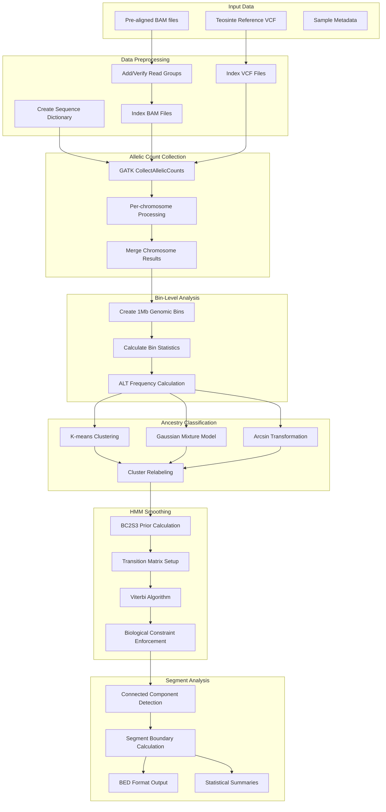

# Understanding WideSeq Read Count Collection and Ancestry Analysis Workflow

## Table of Contents
- [1. Overview](#1-overview)
- [2. Pipeline Architecture](#2-pipeline-architecture)
- [3. Data Preprocessing Steps](#3-data-preprocessing-steps)
- [4. Allelic Count Collection](#4-allelic-count-collection)
- [5. Bin-Level Analysis](#5-bin-level-analysis)
- [6. Ancestry Classification Methods](#6-ancestry-classification-methods)
- [7. HMM Smoothing and Biological Constraints](#7-hmm-smoothing-and-biological-constraints)
- [8. Segment Extraction and Analysis](#8-segment-extraction-and-analysis)
- [9. High-Performance Computing Implementation](#9-high-performance-computing-implementation)
- [10. Output Formats and Integration](#10-output-formats-and-integration)

## 1. Overview

The WideSeq analysis pipeline is designed to efficiently collect allelic counts at teosinte-specific variant positions and perform comprehensive ancestry analysis in maize Near Isogenic Lines (NILs). This approach provides a more efficient alternative to traditional variant calling by directly counting reads at predetermined positions without the computational overhead of full genotype calling.

### Key Pipeline Features
- **Position-specific analysis**: Focus on teosinte reference panel variants
- **Raw read count collection**: More precise than genotype calls
- **Bin-level statistical analysis**: Aggregate variants into genomic windows
- **Multiple clustering approaches**: Robust ancestry classification
- **HMM smoothing**: Biological constraint enforcement
- **Scalable design**: High-performance computing optimization

### Expected Input Data
- **Pre-aligned BAM files**: WideSeq samples aligned to B73v5 reference
- **Teosinte reference variants**: Processed from Schnable2023 dataset
- **Sample metadata**: Breeding history and experimental design information

## 2. Pipeline Architecture

### 2.1 Workflow Overview



### 2.2 Computational Strategy

The pipeline employs a **divide-and-conquer approach**:
1. **Chromosome-wise processing**: Parallel execution across chromosomes
2. **Sample-wise analysis**: Independent processing enables scaling
3. **Hierarchical data structure**: Raw counts → bins → segments → genome-wide summary

## 3. Data Preprocessing Steps

### 3.1 Creating Sequence Dictionary

```bash
picard CreateSequenceDictionary \
    --REFERENCE="../ref/Zm-B73-REFERENCE-NAM-5.0.fa" \
    --OUTPUT="../ref/Zm-B73-REFERENCE-NAM-5.0.dict"
```

**Reasoning**: GATK tools require a sequence dictionary (.dict) file alongside the reference genome. This file contains metadata about the reference genome's contigs (chromosomes) including their names and lengths. Creating this dictionary is a one-time preprocessing step necessary for all subsequent GATK operations.

**Output**: A `.dict` file containing:
- Sequence names and lengths
- MD5 checksums for validation
- Assembly information

### 3.2 Adding Read Groups to BAM Files

```bash
picard AddOrReplaceReadGroups \
  -I /path/to/sample.bam \
  -O bam/sample_sorted_rg.bam \
  --RGID "${PLATE_NUM}" \
  --RGPL illumina \
  --RGLB "${SAMPLE}" \
  --RGPU NONE \
  --RGSM "${SAMPLE}"
```

**Reasoning**: GATK tools require read group information in BAM files. Read groups identify which reads belong to the same sequencing run and sample, which is essential for proper variant calling and read count collection. Without read groups, GATK will refuse to process the BAM files.

**Read Group Components**:
- **RGID**: Read group identifier (often plate number)
- **RGPL**: Platform/technology (illumina)
- **RGLB**: Library identifier (sample name)
- **RGPU**: Platform unit (NONE if not applicable)
- **RGSM**: Sample name

### 3.3 Indexing BAM and VCF Files

```bash
# Index BAM files for random access
samtools index bam/sample_sorted_rg.bam

# Index VCF files for GATK and bcftools compatibility
gatk IndexFeatureFile -I ./wideseq_ref/wideseq_chr10.vcf.gz
bcftools index ./wideseq_ref/wideseq_chr10.vcf.gz
```

**Reasoning**: Indexed files enable random access to specific genomic regions, dramatically improving performance for region-specific operations. Both .bai (BAM index) and .tbi/.idx (VCF index) files are created to ensure compatibility with different tools.

## 4. Allelic Count Collection

### 4.1 Core GATK CollectAllelicCounts Operation

```bash
gatk CollectAllelicCounts \
    -I bam/sample_sorted_rg.bam \
    -R ../ref/Zm-B73-REFERENCE-NAM-5.0.fa \
    -L ./wideseq_ref/wideseq_chr10.vcf.gz \
    -O ./bzea/sample_chr10.allelicCounts.tsv
```

**Process Description**:
1. **Input validation**: Verify BAM, reference, and interval files
2. **Region iteration**: Process each position in the VCF interval list
3. **Read extraction**: Collect all reads overlapping each position
4. **Allele counting**: Count reads supporting reference vs. alternate alleles
5. **Quality filtering**: Apply base quality and mapping quality thresholds

**Output Format**:
```
CONTIG  POSITION    REF_NUCLEOTIDE    ALT_NUCLEOTIDE    REF_COUNT    ALT_COUNT    TOTAL_COUNT
chr1    1234567     A                 G                 15           5            20
chr1    2345678     C                 T                 8            12           20
```

### 4.2 Advantages of Allelic Count Approach

1. **Efficiency**: Only examines positions in the teosinte reference panel
2. **Accuracy**: Raw read counts provide more precise information than genotype calls
3. **Low-coverage robustness**: Even few reads provide useful allele balance information
4. **Consistency**: Same positions analyzed across all samples for comparability
5. **Flexibility**: Raw counts enable downstream method comparison

### 4.3 Per-Chromosome Processing Strategy

The pipeline processes each chromosome independently to optimize resource usage:

```bash
# Process all 10 chromosomes in parallel
for CHR in chr1 chr2 chr3 chr4 chr5 chr6 chr7 chr8 chr9 chr10; do
    CHR_NUM=${CHR#chr}  # Extract numeric part
    
    gatk CollectAllelicCounts \
        -I "${PROCESSED_BAM}" \
        -R "${REF_GENOME}" \
        -L "${WIDESEQ_REF_DIR}/wideseq_chr${CHR_NUM}.vcf.gz" \
        -O "${OUTPUT_DIR}/${SAMPLE}_chr${CHR_NUM}.allelicCounts.tsv"
done
```

### 4.4 Chromosome Result Merging

```bash
# Create merged file with proper header structure
grep "^@" "${OUTPUT_DIR}/${SAMPLE}_chr1.allelicCounts.tsv" > "${MERGED_OUTPUT}"
grep -v "^@" "${OUTPUT_DIR}/${SAMPLE}_chr1.allelicCounts.tsv" | head -n 1 >> "${MERGED_OUTPUT}"

# Append data from all chromosomes
for CHR_NUM in {1..10}; do
    grep -v "^@" "${OUTPUT_DIR}/${SAMPLE}_chr${CHR_NUM}.allelicCounts.tsv" | tail -n +2 >> "${MERGED_OUTPUT}"
done
```

## 5. Bin-Level Analysis

### 5.1 Genomic Binning Strategy

The pipeline aggregates variant-level data into 1Mb genomic bins to:
- **Reduce noise**: Average out sequencing errors and technical artifacts
- **Improve statistical power**: Combine information from multiple variants
- **Enable genome-wide analysis**: Create manageable data structure for visualization
- **Match recombination scale**: ~1Mb corresponds to ~1cM in maize

### 5.2 Bin Statistics Calculation

```r
# R code for bin-level processing
read_freq <- read_count %>%
  group_by(CONTIG) %>%
  mutate(
    BIN_POS = ceiling(POSITION / bin_size),
    READ_DEPTH = ALT_COUNT + REF_COUNT
  ) %>%
  group_by(CONTIG, BIN_POS) %>%
  summarise(
    SAMPLE = sample_name,
    VARIANT_COUNT = n(),
    INFORMATIVE_VARIANT_COUNT = sum(ALT_COUNT + REF_COUNT > 0),
    DEPTH_SUM = sum(READ_DEPTH),
    ALT_COUNT = sum(ALT_COUNT),
    ALT_FREQ = ifelse(sum(READ_DEPTH) > 0, sum(ALT_COUNT) / sum(READ_DEPTH), 0),
    BIN_START = min(POSITION),
    BIN_END = max(POSITION),
    .groups = 'drop'
  )
```

**Key Metrics**:
- **VARIANT_COUNT**: Total variants in bin
- **INFORMATIVE_VARIANT_COUNT**: Variants with read coverage
- **DEPTH_SUM**: Total read depth across all variants
- **ALT_FREQ**: Alternative allele frequency (key for ancestry calling)
- **BIN_START/END**: Physical boundaries of the bin

### 5.3 Alternative Allele Frequency Distribution

The ALT_FREQ metric is central to ancestry classification:
- **ALT_FREQ = 0**: Homozygous reference (REF)
- **ALT_FREQ ≈ 0.5**: Heterozygous (HET)  
- **ALT_FREQ = 1**: Homozygous alternative (ALT)

## 6. Ancestry Classification Methods

### 6.1 Multi-Method Clustering Approach

The pipeline employs multiple clustering methods for robust ancestry classification:

#### 6.1.1 K-means Clustering on Raw ALT_FREQ

```r
# Direct K-means clustering
non_zero_bins$Kraw <- as.factor(
  Ckmeans.1d.dp::Ckmeans.1d.dp(non_zero_bins$ALT_FREQ, K = 3)$cluster
)
```

#### 6.1.2 K-means with Arcsin Transformation

```r
# Arcsin square root transformation for better separation
non_zero_bins$asin <- asin(sqrt(non_zero_bins$ALT_FREQ))
non_zero_bins$Kasin <- as.factor(
  Ckmeans.1d.dp::Ckmeans.1d.dp(non_zero_bins$asin, K = 3)$cluster
)
```

**Transformation Rationale**: The arcsin square root transformation:
- **Normalizes variance**: Stabilizes variance across the range
- **Improves separation**: Better distinguishes intermediate frequencies
- **Handles boundary effects**: Reduces compression near 0 and 1

#### 6.1.3 Gaussian Mixture Model

```r
# Fit Gaussian mixture model with 3 components
normalest <- REBMIX(
  Dataset = list(data.frame(Value = non_zero_bins$asin)),
  Preprocessing = "histogram",
  cmin = 3, cmax = 3,
  Criterion = "BIC",
  pdf = "normal"
)

normclu <- RCLRMIX(x = normalest)
non_zero_bins$Kgmm <- as.factor(normclu@Zp)
```

**GMM Advantages**:
- **Probabilistic framework**: Accounts for uncertainty in classification
- **Flexible cluster shapes**: Not restricted to spherical clusters
- **Model selection**: BIC criterion for optimal model complexity

### 6.2 Cluster Relabeling Strategy

All clustering methods require post-processing to ensure consistent biological interpretation:

```r
relabel_clusters <- function(clusters, data) {
  # Calculate mean ALT_FREQ for each cluster
  cluster_means <- tapply(data$ALT_FREQ, clusters, mean)
  
  # Order clusters by mean ALT_FREQ
  ordered_clusters <- order(cluster_means)
  
  # Create mapping: lowest → REF, middle → HET, highest → ALT
  cluster_map <- rep(NA, length(unique(as.numeric(clusters))))
  cluster_map[ordered_clusters[1]] <- "REF"
  cluster_map[ordered_clusters[2]] <- "HET"
  cluster_map[ordered_clusters[3]] <- "ALT"
  
  # Apply mapping
  factor(cluster_map[as.numeric(clusters)], levels = c("REF", "HET", "ALT"))
}
```

**Relabeling Logic**:
- Clusters ordered by mean ALT_FREQ
- Lowest frequency → REF (recurrent parent)
- Middle frequency → HET (heterozygous)
- Highest frequency → ALT (donor introgression)

### 6.3 Zero-ALT Bin Handling

Bins with ALT_FREQ = 0 are automatically classified as REF without clustering:

```r
# Force bins with ALT_FREQ = 0 to be "REF"
zero_idx <- which(read_freq$ALT_FREQ == 0)
for (method in c("Kraw", "Kasin", "Kgmm")) {
  read_freq[[method]][zero_idx] <- "REF"
}
```

This ensures biological consistency and reduces computational requirements.

## 7. HMM Smoothing and Biological Constraints

### 7.1 Breeding Design Expectations

The HMM smoothing incorporates prior knowledge from the BC2S3 breeding scheme:

```r
# Calculate expected genotype frequencies for BC2S3
bc2s3 <- nil_frequencies_for_hmm(bc = 2, s = 3, donor_type = "aa")
```

**BC2S3 Expected Frequencies**:
- **REF**: ~86% (recurrent parent background)
- **HET**: ~3% (residual heterozygosity)  
- **ALT**: ~11% (donor introgressions)

### 7.2 HMM Parameter Setup

```r
smooth_ancestry_with_hmm <- function(genotypes, transitions = c(0.995, 0.005)) {
  # Transition probabilities (high self-transition)
  trans_prob <- matrix(c(
    transitions[1], transitions[2]/2, transitions[2]/2,  # From REF
    transitions[2]/2, transitions[1], transitions[2]/2,  # From HET
    transitions[2]/2, transitions[2]/2, transitions[1]   # From ALT
  ), nrow = 3, byrow = TRUE)
  
  # Emission probabilities (classification uncertainty)
  emiss_prob <- matrix(c(
    0.9, 0.08, 0.02,  # REF state → observed classifications
    0.1, 0.8, 0.1,    # HET state → observed classifications
    0.02, 0.08, 0.9   # ALT state → observed classifications
  ), nrow = 3, byrow = TRUE)
}
```

**Parameter Interpretation**:
- **High self-transitions** (0.995): Models genomic linkage
- **Low switch probability** (0.005): Corresponds to ~1cM recombination
- **Emission uncertainty**: Accounts for classification errors

### 7.3 Viterbi Algorithm Application

```r
# Initialize HMM with BC2S3 priors
hmm <- HMM::initHMM(
  c("REF", "HET", "ALT"), 
  c("0", "1", "2"), 
  startProbs = bc2s3,
  transProbs = trans_prob, 
  emissionProbs = emiss_prob
)

# Find most likely state sequence
viterbi_path <- HMM::viterbi(hmm, as.character(geno_numeric))
```

The Viterbi algorithm finds the most probable sequence of ancestry states given:
- The observed cluster classifications
- The breeding design priors
- The linkage constraints

### 7.4 Biological Constraint Enforcement

HMM smoothing enforces several biological constraints:

1. **Genomic linkage**: Adjacent bins should have similar ancestry
2. **Recombination limits**: Transitions should be rare (~1 per chromosome)
3. **Breeding expectations**: Overall frequencies should match BC2S3
4. **Classification uncertainty**: Account for technical noise

## 8. Segment Extraction and Analysis

### 8.1 Connected Component Detection

After HMM smoothing, the pipeline identifies contiguous ancestry segments:

```r
# Use run-length encoding to find segments
extract_genotype_segments <- function(chr_data, samp, chr, geno) {
  # Create state column
  chr_tbl <- chr_data %>%
    arrange(start) %>%
    mutate(state = ifelse(genotype == geno, 1, 0))
  
  # Run length encoding to find consecutive segments
  rle_result <- rle(chr_tbl$state)
  
  # Calculate segment boundaries
  segment_ends <- cumsum(rle_result$lengths)
  segment_starts <- c(1, segment_ends[-length(segment_ends)] + 1)
}
```

### 8.2 Segment Boundary Calculation

For each contiguous segment:

```r
# Get the minimum start and maximum end positions
segment_bins <- chr_tbl[start_idx:end_idx, ]
min_start <- min(segment_bins$start)
max_end <- max(segment_bins$end)

# Calculate segment length and statistics
segment_length <- max_end - min_start + 1
mean_score <- mean(segment_bins$score, na.rm = TRUE)
mean_alt_freq <- mean(segment_bins$alt_freq, na.rm = TRUE)
```

### 8.3 BED Format Output

Segments are output in standard BED format for genome browser visualization:

```
sample    chrom    start      end        genotype    score    alt_freq
sample1   chr1     1000000    3000000    ALT         2.0      0.85
sample1   chr1     5000000    6000000    HET         1.0      0.52
```

**BED Format Advantages**:
- **Standardized**: Compatible with genome browsers (IGV, UCSC)
- **Compressed**: Efficient storage of segment information
- **Analyzable**: Easy integration with genomic analysis tools

### 8.4 Segment Statistics

The pipeline calculates comprehensive statistics for each segment type:

```r
# Segment length distribution by genotype
segment_stats <- non_ref_segments %>%
  group_by(genotype) %>%
  summarize(
    count = n(),
    min_length = min(length_mb),
    median_length = median(length_mb),
    mean_length = mean(length_mb),
    max_length = max(length_mb),
    total_length = sum(length_mb)
  )
```

**Key Metrics**:
- **Segment count**: Number of introgression blocks
- **Length distribution**: Size characteristics of introgressions
- **Total coverage**: Genome fraction with donor ancestry
- **Largest segment**: Primary introgression block per chromosome

## 9. High-Performance Computing Implementation

### 9.1 LSF Job Scheduling

The pipeline is designed for LSF (Load Sharing Facility) job schedulers:

```bash
#BSUB -J wideseq_${SAMPLE}
#BSUB -q ${LSF_QUEUE}
#BSUB -n ${LSF_CORES}
#BSUB -W 180
#BSUB -R "rusage[mem=${LSF_MEMORY}]"
#BSUB -o ${SCRIPTS_DIR}/wideseq_${SAMPLE}_%J.out
#BSUB -e ${SCRIPTS_DIR}/wideseq_${SAMPLE}_%J.err
```

**Resource Requirements**:
- **Memory**: 16GB per sample (accommodates large BAM files)
- **Cores**: 4 cores (parallel chromosome processing)
- **Time**: 3 hours (wall time limit)
- **Queue**: Configurable based on cluster setup

### 9.2 Parallel Processing Strategy

#### 9.2.1 Sample-Level Parallelization

```bash
# Create individual job scripts for each sample
for BAM_FILE in "${BAM_FILES[@]}"; do
    SAMPLE=$(basename "${BAM_FILE}" .bam)
    
    # Generate sample-specific job script
    JOB_SCRIPT="${SCRIPTS_DIR}/wideseq_${SAMPLE}.sh"
    create_sample_job_script "${SAMPLE}" "${BAM_FILE}" > "${JOB_SCRIPT}"
    
    # Add to submission script
    echo "bsub < ${JOB_SCRIPT}" >> "${SUBMIT_SCRIPT}"
done
```

#### 9.2.2 Chromosome-Level Parallelization

Within each sample, chromosomes are processed in sequence but can be parallelized:

```bash
# Process chromosomes sequentially (memory-efficient)
for CHR in "${CHROMOSOMES[@]}"; do
    CHR_NUM=${CHR#chr}
    
    gatk CollectAllelicCounts \
        -I "${PROCESSED_BAM}" \
        -R "${REF_GENOME}" \
        -L "${WIDESEQ_REF_DIR}/wideseq_chr${CHR_NUM}.vcf.gz" \
        -O "${OUTPUT_DIR}/${SAMPLE}_chr${CHR_NUM}.allelicCounts.tsv"
done
```

### 9.3 Resource Monitoring and Cleanup

```bash
# Monitor resource usage
VARIANT_POSITIONS=$(grep -v "^@" "${MERGED_OUTPUT}" | wc -l)
VARIANT_POSITIONS=$((VARIANT_POSITIONS - 1))  # Subtract header

echo "=== WideSeq Summary for ${SAMPLE} ==="
echo "Total positions collected: ${VARIANT_POSITIONS}"
echo "Results: ${MERGED_OUTPUT}"

# Cleanup temporary files
rm -f "${OUTPUT_DIR}/${SAMPLE}_chr*.allelicCounts.tsv"
```

### 9.4 Error Handling and Recovery

```bash
# Comprehensive error checking
if [ $? -ne 0 ]; then
    echo "Error: Failed to collect allelic counts for ${SAMPLE} on ${CHR}"
    exit 1
fi

# Validate outputs
if [ ! -f "${MERGED_OUTPUT}" ]; then
    echo "Error: Failed to create merged output file for ${SAMPLE}"
    exit 1
fi
```

## 10. Output Formats and Integration

### 10.1 Primary Output Files

#### 10.1.1 Bin-Level Genotypes

```
SAMPLE        CONTIG  BIN_POS  BIN_START  BIN_END    GENOTYPE  ALT_FREQ  VARIANT_COUNT
sample1       chr1    1        1          1000000    REF       0.02      247
sample1       chr1    2        1000001    2000000    HET       0.48      312
sample1       chr1    3        2000001    3000000    ALT       0.92      298
```

#### 10.1.2 Ancestry Segments (BED format)

```
sample1  chr1  1000000   3000000  ALT  2.0  0.85
sample1  chr1  5000000   6000000  HET  1.0  0.52
sample1  chr2  10000000  12000000 ALT  2.0  0.91
```

#### 10.1.3 Summary Statistics

```
sample      total_bins  REF_bins  HET_bins  ALT_bins  REF_pct  HET_pct  ALT_pct  non_ref_pct
sample1     2132        1847      89        196       86.6     4.2      9.2      13.4
sample2     2132        1923      71        138       90.2     3.3      6.5      9.8
```

### 10.2 Quality Control Outputs

#### 10.2.1 Method Comparison

```
Method                    REF_pct  HET_pct  ALT_pct
K-means                   86.1     4.1      9.8
K-means (arcsin)          86.3     3.9      9.8
Gaussian Mixture          86.2     4.0      9.8
Expected BC2S3            86.0     3.0      11.0
```

#### 10.2.2 HMM Smoothing Effects

```
Method              Changes_pct  Transitions_reduced
K-means → HMM       2.3%         45%
Kasin → HMM         1.8%         38%
GMM → HMM           1.1%         31%
```

### 10.3 Integration with R Package

The pipeline outputs are designed for seamless integration with the BzeaSeq R package:

```r
# Load and process pipeline outputs
library(BzeaSeq)

# Read bin-level data
bin_data <- read.table("sample_bin_genotypes.tsv", header = TRUE)

# Process for visualization
processed_data <- process_introgression_data(bin_data)

# Create plots
chromosome_plots <- plot_introgression_stacked(processed_data)

# Convert to matrix format for ComplexHeatmap
matrix_data <- convert_to_matrix(processed_data)
```

### 10.4 Downstream Analysis Integration

The WideSeq outputs support multiple downstream analyses:

1. **Phylogenetic analysis**: Segment-based similarity calculations
2. **Population genetics**: Introgression frequency and distribution
3. **Functional analysis**: Gene content in introgressed regions
4. **Breeding applications**: Marker-assisted selection strategies

## Conclusion

The WideSeq pipeline provides a comprehensive framework for ancestry analysis in maize introgression lines. By combining efficient allelic count collection with robust statistical methods and biological constraints, it delivers accurate and reproducible results suitable for both research and breeding applications.

**Key Advantages**:
- **Efficiency**: Position-specific analysis reduces computational requirements
- **Accuracy**: Multiple clustering methods with HMM smoothing
- **Scalability**: High-performance computing optimization
- **Reproducibility**: Standardized outputs and quality control
- **Integration**: Seamless connection with R analysis packages

The pipeline's modular design allows for easy adaptation to different breeding schemes, reference panels, and computational environments while maintaining biological accuracy and statistical rigor.
