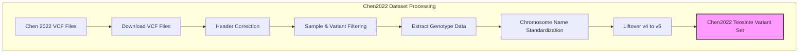

# Chen2022 Dataset Processing for BzeaSeq Project

## Table of Contents
- [1. Overview](#1-overview)
- [2. Workflow Diagram](#2-workflow-diagram)
- [3. Data Acquisition](#3-data-acquisition)
- [4. Data Exploration](#4-data-exploration)
- [5. Data Processing Pipeline](#5-data-processing-pipeline)
- [6. Integration with Schnable2023](#6-integration-with-schnable2023)
- [7. References](#7-references)

## 1. Overview

This document describes the processing workflow for the Chen2022 dataset as part of the BzeaSeq project. The Chen2022 study published in Nature ("Genome sequencing reveals evidence of adaptive variation in the genus *Zea*") includes approximately 75 million SNPs from teosinte samples in B73 reference genome version 4. The processing includes downloading, filtering, and lifting over to reference genome version 5 for integration into the WideSeq pipeline.

> **Note**: For the current Teosinte Reference Variant Set construction, we have shifted to using the Schnable2023 dataset, which is already aligned to B73v5. This document is maintained for reference purposes.

## 2. Workflow Diagram



## 3. Data Acquisition

The SNP data is distributed across multiple files named `merge_1.filter.vcf.gz` through `merge_10.filter.vcf.gz` and is available from the Chinese National GeneBank (CNGB).

### 3.1 Download Script

```bash
#!/bin/bash
# download_chen2022_SNPs.sh
#
# Downloads VCF files specified by START_NUM and END_NUM from the Chen 2022 Zea mays
# dataset via Aspera (ascp).
# Includes MD5 checksum verification after download, reading expected checksums
# from an external file (snp.vcf.md5) downloaded from the same remote directory.
# Assumes snp.vcf.md5 format: <checksum><whitespace><filename> per line.
# Handles multiple spaces or tabs as delimiters between checksum and filename.
#
# Source: https://ftp.cngb.org/pub/CNSA/data3/CNP0001565/zeamap/02_Variants/PAN_Zea_Variants/Zea-vardb/

# --- Configuration ---
KEY_FILE="aspera_download.key"
KEY_URL="ftp://ftp.cngb.org/pub/Tool/Aspera/aspera_download.key" # URL to fetch the key
REMOTE_USER_HOST="aspera_download@183.239.175.39" # Aspera server address
REMOTE_BASE_DIR="/pub/CNSA/data3/CNP0001565/zeamap/02_Variants/PAN_Zea_Variants/Zea-vardb" # Base remote dir for VCFs and MD5 file
ASCP_PORT="33001" # Aspera port
ASCP_RATE="100m"  # Max transfer rate for VCF files (e.g., 100m = 100 Mbps)
ASCP_MD5_RATE="10m" # Max transfer rate for the small MD5 file
ASCP_OPTS="-T -k 1"  # Aspera options: -T disable encryption, -k 1 enable resume
LOCAL_DEST_DIR="./"  # Download destination (current directory)
START_NUM=1          # First file number to download (e.g., merge_1.filter.vcf.gz)
END_NUM=10           # Last file number to download (e.g., merge_10.filter.vcf.gz)

MD5_FILENAME="snp.vcf.md5" # Local and remote name for the checksum file
REMOTE_MD5_FILE_PATH="${REMOTE_USER_HOST}:${REMOTE_BASE_DIR}/${MD5_FILENAME}" # Full remote path for ascp
LOCAL_MD5_FILE_PATH="${LOCAL_DEST_DIR}/${MD5_FILENAME}" # Local path for the checksum file
# --- End Configuration ---

# --- Script Implementation ---
# [Script implementation details as in the README.md file]
# --- End Script Implementation ---
```

## 4. Data Exploration

### 4.1 Sample and Variant Statistics

To verify the downloaded data, we examined the number of samples and variants:

```bash
bcftools query -l ../Zea-vardb/merge_10.filter.vcf.gz| wc -l
```

```
744
```

```bash
bcftools stats ../Zea-vardb/merge_10.filter.vcf.gz > merge_10.filter.stats
more merge_10.filter.stats
```

```
SN	0	number of samples:	744
SN	0	number of records:	5055237
SN	0	number of no-ALTs:	0
SN	0	number of SNPs:	5055237
SN	0	number of MNPs:	0
SN	0	number of indels:	0
SN	0	number of others:	0
SN	0	number of multiallelic sites:	319084
SN	0	number of multiallelic SNP sites:	319084
```

The statistics showed 744 samples and over 5 million SNPs in chromosome 10 alone, confirming the dataset contains more than 70 million SNPs across all chromosomes.

### 4.2 Reference Genotype Confirmation

We confirmed that B73 (the reference genotype) was included in the dataset:

```bash
grep B73 chen2022_passport.tab
```

```
B73	-	-	-	285169576	277505548	97.31 	97.47 	19.72 	60259366	21.13 	-	-	Zea mays subsp. mays	Zea mays subsp. mays (TEM)
```

### 4.3 Teosinte Sample Analysis

The dataset contained 238 teosinte samples (non-maize subspecies and non-Tripsacum):

```bash
grep -v "subsp. mays" chen2022_passport.tab | grep -v "Tripsacum" | wc -l
```

```
238
```

The taxonomic breakdown of teosinte samples was as follows:

```bash
grep -v "subsp. mays" chen2022_passport.tab | grep -v "Tripsacum"| cut -f 15|  sort |uniq -c
```

```
      1 New taxonomyb
     14 Teosinte (mix)
     20 Zea diploperennis
     14 Zea luxurians
      5 Zea mays subsp. huehuetenangensis
     81 Zea mays subsp. mexicana
     70 Zea mays subsp. parviglumis
     14 Zea nicaraguensis
     19 Zea perennis
```

### 4.4 Sample Selection for Analysis

To prepare for downstream analysis, we selected teosinte samples and the B73 reference:

```bash
tail -n +2 chen2022_passport.tab| grep -v "subsp. mays"  |grep -v "Tripsacum"| cut -f1 > teosinte_id.list
grep B73 chen2022_passport.tab | cut -f1 >  B73_id.list
cat B73_id.list teosinte_id.list > wideseq_ref_id.list
more wideseq_ref_id.list
```

## 5. Data Processing Pipeline

### 5.1 Header Correction

The VCF files had improper headers that needed to be fixed before processing:

```bash
# Replace existing headers with corrected ones
bcftools reheader -h chen2022_vcf_header.txt ../Zea-vardb/merge_10.filter.vcf.gz -o ../Zea-vardb/merge_10.header.vcf.gz

# Alternative using Picard
picard FixVcfHeader \
     --CHECK_FIRST_N_RECORDS 1000 \
     -I ../Zea-vardb/merge_10.filter.vcf.gz \
     -O ../Zea-vardb/merge_10.header.vcf.gz
```

### 5.2 Sample and Variant Filtering

Extract only samples of interest and apply filtering:
<<<<<<< HEAD
Note from  https://github.com/samtools/bcftools/issues/1807

 Also note that one must be careful when sample subsetting and filtering is performed in a single command 
 because the order of internal operations can influence the result. For example, the *-i/-e* filtering 
 is performed before sample removal, but the *-P* filtering is performed after, 
 and some are inherently ambiguous, for example allele counts can be taken from the INFO 
 column when present but calculated on the fly when absent. Therefore it is strongly recommended to spell out the 
 required order explicitly by separating such commands into two steps. (Make sure to use the *-O u* option 
 when piping!) 
 
This need to be done in two steps then
```bash
# Select samples and filter for variants with MAF > 0.05
bcftools view -S wideseq_ref_id.list  \
  ../Zea-vardb/merge_10.header.vcf.gz \
  -o ../Zea-vardb/chr10.wideseq.v4.vcf.gz

bcftools view -q 0.05:minor \
=======

```bash
# Select samples and filter for variants with MAF > 0.05
bcftools view -q 0.05:minor -S wideseq_ref_id.list --min-ac=1 \
>>>>>>> refs/remotes/origin/main
  ../Zea-vardb/merge_10.header.vcf.gz \
  -o ../Zea-vardb/chr10.wideseq.v4.vcf.gz
```

### 5.3 Creating Minimal VCF Files

To reduce file sizes and simplify processing, we created minimal VCF files containing only genotype (GT) information with no additional FORMAT or INFO fields:

```bash
# Create a minimal VCF with only GT field, no other FORMAT or INFO fields
bcftools annotate -x INFO,^FORMAT/GT \
  ../Zea-vardb/chr10.wideseq.v4.vcf.gz \
  -Oz -o ../Zea-vardb/chr10.wideseq.v4.minimal.vcf.gz 

# Index the output file
bcftools index ../Zea-vardb/chr10.wideseq.v4.minimal.vcf.gz 
```

### 5.4 Chromosome Naming Standardization

Different references used different chromosome naming conventions, so we standardized chromosome names to ensure compatibility:

```bash
# For VCF files - change chromosome names to match reference
for i in $(seq 1 10); do
  # Create temporary file with chr names converted to Chr format
  bcftools annotate --rename-chrs chr_name_map.txt \
    ../Zea-vardb/merge_${i}.header.vcf.gz \
    -o ../Zea-vardb/merge_${i}.renamed.vcf.gz
  
  # Index the renamed files
  bcftools index ../Zea-vardb/merge_${i}.renamed.vcf.gz
done
```

Where `chr_name_map.txt` contained:
```
1   Chr1
2   Chr2
3   Chr3
4   Chr4
5   Chr5
6   Chr6
7   Chr7
8   Chr8
9   Chr9
10  Chr10
```

### 5.5 Liftover from v4 to v5 Reference

First, we fixed the chain file format:

```bash
# Convert spaces to tabs in chain file for compatibility with tools
perl -i -pe 'if ($_ !~ /chain/) {s/ +/\t/g}' B73_RefGen_v4_to_Zm-B73-REFERENCE-NAM-5.0.chain
```

Then we performed liftover for each chromosome:

```bash
# Liftover script
for i in $(seq 1 10); do
  picard LiftoverVcf \
    I=../Zea-vardb/merge_${i}.renamed.vcf.gz \
    O=../Zea-vardb/v5/merge_${i}.v5.vcf \
    CHAIN=B73_RefGen_v4_to_Zm-B73-REFERENCE-NAM-5.0.chain \
    REJECT=../Zea-vardb/v5/merge_${i}.rejected.vcf \
    R=Zm-B73-REFERENCE-NAM-5.0.fa
    
  # Compress and index result
  bgzip -f ../Zea-vardb/v5/merge_${i}.v5.vcf
  bcftools index ../Zea-vardb/v5/merge_${i}.v5.vcf.gz
done
```

## 6. Integration with Schnable2023

To maintain compatibility between datasets and document the relationship between Chen2022 and Schnable2023, we identified overlapping samples:

```bash
# Check which Chen2022 samples are in Schnable2023
grep -w -f chen2022_id.list schnable2023_id.list > overlapping_samples.list
grep -w -f chen2022_id.list schnable2023_id.list | wc -l

# Check which reference samples are in Schnable2023
grep -w -f wideseq_ref_id.list schnable2023_id.list | wc -l
```

The comparison helps validate that key reference samples are present in both datasets, allowing for cross-validation of variant calls.

## 7. References

1. Chen, Q., Lu, Y., Yang, Y. et al. Genome sequencing reveals evidence of adaptive variation in the genus Zea. Nat Genet 54, 1386–1396 (2022). https://doi.org/10.1038/s41588-022-01184-y

2. Schnable, J.C., et al. (2023). Exploring the pan-genome of the *Zea* genus through genome-wide association studies. The Plant Journal, 116(1), 225-238. https://doi.org/10.1111/t